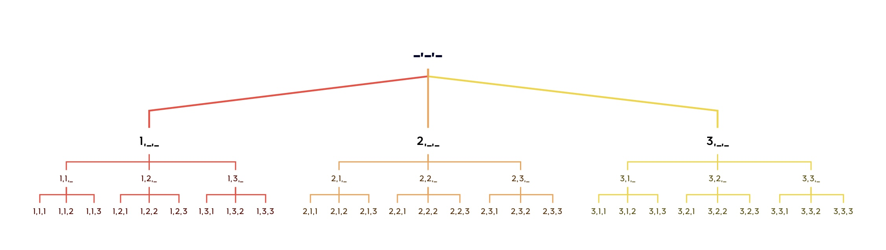
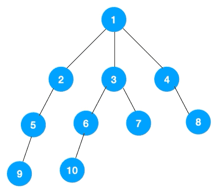
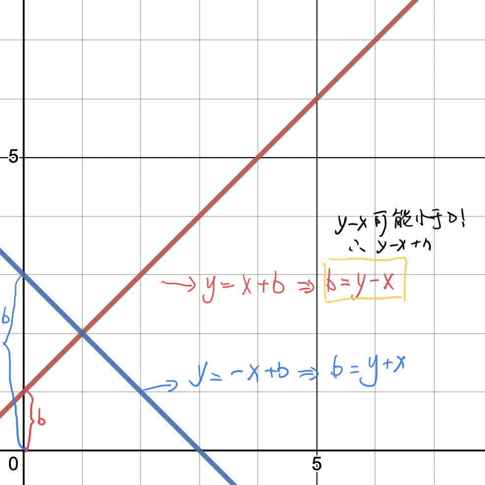

### DFS(Depth First Search)-深度优先搜索

- ##### 一种用于遍历或搜索树或图的算法。 沿着树的深度遍历树的节点，尽可能深的搜索树的分支。当节点v的所在边都己被探寻过或者在搜寻时结点不满足条件，搜索将回溯到发现节点v的那条边的起始节点。整个进程反复进行直到所有节点都被访问为止。属于盲目搜索,最糟糕的情况算法时间复杂度为O(!n)。

先看一个DFS的基础的应用示例：

##### 123的全排列：



- DFS属于“傻瓜式”的暴力枚举，它会从树根直到叶子，依次枚举所有的情况，如果不满足，则回溯到父节点。
- **DFS中两个重要的概念：回溯、剪枝**

- DFS解决问题的思路：
  1. 从搜索树的角度考虑，每一条DFS都一定对应一个搜索树
  2. 用什么样的顺序，把某道题目的所有方案全部遍历一遍


### BFS(Breadth First Search)-广度优先搜索


#### BFS拥有最短路的特性（因为BFS是一层一层搜索，最先入队的一定是距离最短的路径）

##### 注：能用DFS解决的一般BFS也能解决，但是BFS能解决的DFS不一定可以，这是因为DFS是暴力搜索，所有的路径都会搜索。

#### BFS遍历方式：





##### BFS问题代码框架：

**初始-->queue**

**while (queue不空) {**

​	**pop();//队头出列**

​	**push();//扩展队头**

**}**


- ##### DFS与BFS的对比：

| 搜索算法         | 数据结构   | 空间    | 特点                                                   |
| ---------------- | ---------- | ------- | ------------------------------------------------------ |
| 深度优先搜索-DFS | 栈-stack   | O(h)    | 不具有**最短路性**(第一次搜索到路径一定是距离最近的点) |
| 宽度优先搜索-BFS | 队列-queue | O(2^h^) | 最短路性                                               |


#### `相关题目`

#### 全排列问题：

##### AcWing 842.排序数字

给定一个整数 n，将数字 1∼n 排成一排，将会有很多种排列方法。现在，请你按照字典序将所有的排列方法输出。

输入格式：

共一行，包含一个整数 n。

输出格式：

按字典序输出所有排列方案，每个方案占一行。

数据范围：

1≤n≤7

输入样例：

```
3
```

输出样例：

```
1 2 3
1 3 2
2 1 3
2 3 1
3 1 2
3 2 1
```

##### 代码：

```c++
#include <iostream>

using namespace std;

const int N = 10;

int path[N], n;
bool st[N];//true 标志已用，false 表示未用

void dfs(int u) {
     if (u == n) {
          for (int i = 0; i < n; i++) printf("%d ", path[i]);
          puts("");
     }else {
          for (int i = 1; i <= n; i++) {
               if (!st[i]) {
                    path[u] = i;
                    st[i] = true;
                    dfs(u + 1);
                    st[i] = false;
               }
          }
     }
}

int main() {
     
     cin >> n;
     
     dfs(0);
     
     return 0;
}
```


#### n-皇后问题：

##### AcWing 843.n-皇后问题

n− 皇后问题是指将 n 个皇后放在 n×n 的国际象棋棋盘上，使得皇后不能相互攻击到，即任意两个皇后都不能处于同一行、同一列或同一斜线上。


现在给定整数 n，请你输出所有的满足条件的棋子摆法。

输入格式：

共一行，包含整数 n。

输出格式：

每个解决方案占 n 行，每行输出一个长度为 n 的字符串，用来表示完整的棋盘状态。其中 `.` 表示某一个位置的方格状态为空，`Q` 表示某一个位置的方格上摆着皇后。每个方案输出完成后，输出一个空行。

**注意：行末不能有多余空格。**

输出方案的顺序任意，只要不重复且没有遗漏即可。

数据范围：

1≤n≤9

输入样例：

```
4
```

输出样例：

```
.Q..
...Q
Q...
..Q.

..Q.
Q...
...Q
.Q..
```

**代码：**

`两种搜索顺序:`

**1. 按格子来搜索：**

- 每个格子都有两种选择：放、不放
- 越界的情况：1.y(列) == n，需要将y重新置为0，同时，将x++；2.x(行) == n，表示已经到达最后一行，需要判断是否已经放完所有的皇后，如果放完了，则找到了一种放置方法。
- 如何放置皇后：1.每行，每列，对角线，反对角线都没有皇后的情况下，可以放。2.放完之后，dfs后，恢复现场
- 对角线判断有没有皇后：





```c++
#include <iostream>

using namespace std;

const int N = 20;

int n;
char g[N][N];
bool row[N], col[N], dg[N], udg[N];//用来判断是否已经放置过皇后
//左上角->右下角-对角线，右上角->左下角-反对角线

void dfs(int x, int y, int s) {//x-行，y-列，s-目前放置的皇后
     if (s > n) return;
     if (y == n) y = 0, x++;
     if (x == n) {//表明已经走到最后一行了
          if (s == n) {//所有皇后已经放置完毕-print
               for (int i = 0; i < n; i++) puts(g[i]);//puts 用于打印字符串
               puts("");
          }
     }
     //放置皇后的选择
     //1.放
     if (!row[x] && !col[y] && !dg[x + y] && !udg[n - x + y]) {
          g[x][y] = 'Q';
          row[x] = col[y] = dg[x + y] = udg[n - x + y] = true;
          dfs(x, y + 1, s + 1);
          g[x][y] = '.';
          //回溯/恢复现场
          row[x] = col[y] = dg[x + y] = udg[n - x + y] = false;
     }
     //2.不放
     dfs(x, y + 1, s);
}

int main() {
     
     cin >> n;
     //初始化
     for (int i = 0; i < n; i++) {
          for (int j = 0; j < n; j++) {
               g[i][j] = '.';
          }
     }
     
     dfs(0, 0, 0);
     
     return 0;
}
```


**2. 按行来搜索：**

- 选择方式：一共有n行，每行有n个空格决定放那个空格里
- 边界条件：到达最后一行，即：x == n
- 如何放置皇后：因为是按行放，所以只需判断当前行下的每一列是否有皇后，同时，对角线，反对角线是否有皇后

```c++
#include <iostream>

using namespace std;

const int N = 10;

int n;
int g[N][N];
bool col[N], dg[N], udg[N];

void dfs(int x) {
     if (x == n) {
          for (int i = 0; i < n; ++i) puts(g[i]);
          puts("");
          return;
     }
     
     for (int i = 0; i < n; ++i) {
          if (!col[i] && !dg[x + i] && !udg[n - x + i]) {
               g[x][i] = 'Q';
               col[i] = dg[x + i] = udg[n - x + i] = true;
               dfs(x + 1);
               g[x][i] = '.';
               col[i] = dg[x + i] = udg[n - x + i] = false;
          }
     }
}

int main() {
     
     cin >> n;
     //initialize
     for (int i = 0; i < n; ++i) {
          for (int j = 0; j < n; j++) {
               g[i][j] = '.';
          }
     }
     
     dfs(0);
     
     return 0;
}
```


#### 走迷宫问题：

###### AcWing 844.走迷宫

给定一个 n×m 的二维整数数组，用来表示一个迷宫，数组中只包含 0 或 1，其中 0 表示可以走的路，1 表示不可通过的墙壁。

最初，有一个人位于左上角 (1,1) 处，已知该人每次可以向上、下、左、右任意一个方向移动一个位置。

请问，该人从左上角移动至右下角 (n,m) 处，至少需要移动多少次。

数据保证 (1,1) 处和 (n,m) 处的数字为 0，且一定至少存在一条通路。

输入格式：

第一行包含两个整数 n 和 m。接下来 n 行，每行包含 m 个整数（0 或 1），表示完整的二维数组迷宫。

输出格式：

输出一个整数，表示从左上角移动至右下角的最少移动次数。

数据范围：

1≤n,m≤100

输入样例：

```
5 5
0 1 0 0 0
0 1 0 1 0
0 0 0 0 0
0 1 1 1 0
0 0 0 1 0
```

输出样例：

```
8
```

##### 代码：

```c++
#include <iostream>
#include <cstring>
#include <algorithm>
using namespace std;

const int N = 110;
typedef pair <int, int> PII;
int n, m;
int g[N][N];//储存地图
int d[N][N];//储存到起点的距离

int dx[4] = {-1, 0, 1, 0}, dy[4] = {0, 1, 0, -1};//方向偏移量

//队列
PII q[N * N];
int hh = 0, tt = 0;//队头删除元素（出队），队尾插入（入队）

int bfs() {
     //初始化队列
     q[0] = {0, 0};
     memset(d, -1, sizeof d);//d数组是到起点的距离,初始化为-1
     d[0][0] = 0;        //(0, 0)点到起点的距距离为0 
     while (hh <= tt) {
          PII t = q[hh++];
          for (int i = 0; i < 4; i++) {
               int x = t.first + dx[i], y = t.second + dy[i];
               if (x >= 0 && x < n && y >= 0 && y < m && g[x][y] == 0 && d[x][y] == -1) {
                    d[x][y] = d[t.first][t.second] + 1;
                    q[++tt] = {x, y};
               }
          }
     }
     return d[n - 1][m - 1];
}

int main() {
     
     cin >> n >> m;
     
     for (int i = 0; i < n; i++) {
          for (int j = 0; j < m; j++) {
               cin >> g[i][j];
          }
     }
     
     cout << bfs() << endl;
     
     return 0;
}
```

