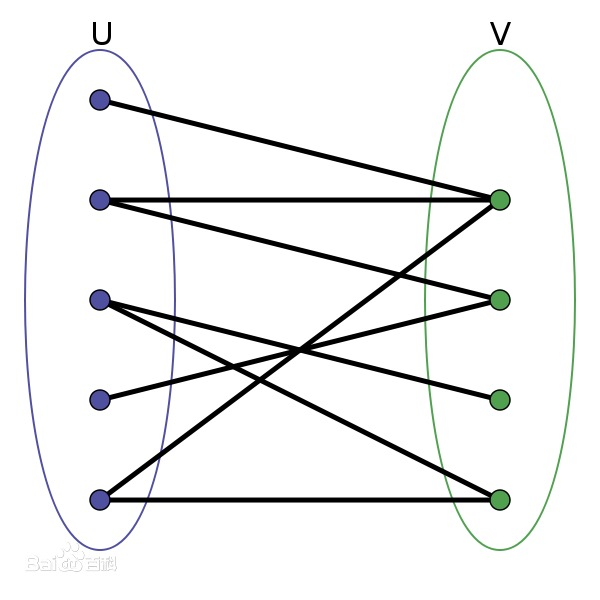

# 二分图


**二分图又称作二部图，是图论中的一种特殊模型。 设G=(V,E)是一个无向图，如果顶点V可分割为两个互不相交的子集(A,B)，并且图中的每条边（i，j）所关联的两个顶点i和j分别属于这两个不同的顶点集(i in A,j in B)，则称图G为一个二分图。**





- ### 大纲：

  


## 染色法


- #### 判断一个图是不是二分图


图论中的一个重要性质：<font color=Red>一个二分图当且仅当图当中不含奇数环</font>


- #### 算法思路：

  - （遍历所有点）for (int i = 1; i <= n; i++)
  - if i (未染色) -> dfs(i, color=1)


##### AcWing 860. 染色法判定二分图

给定一个 n 个点 m 条边的无向图，图中可能存在重边和自环。

请你判断这个图是否是二分图。

输入格式:

第一行包含两个整数 n 和 m。

接下来 m 行，每行包含两个整数 u 和 v，表示点 u 和点 v 之间存在一条边。

输出格式:

如果给定图是二分图，则输出 `Yes` ，否则输出 `No` 。

数据范围:

1≤n,m≤10^5^

输入样例：

```markdown
4 4
1 3
1 4
2 3
2 4
```

输出样例：

```markdown
Yes
```


##### 代码如下：

```c++
#include <iostream>
#include <cstring>
#include <algorithm>

using namespace std;

const int N = 100010, M = 200010;
int n, m;
int h[N], e[M], ne[M], idx;
int color[N];

void add(int a, int b) {
     e[idx] = b, ne[idx] = h[a], h[a] = idx++;
}

bool dfs(int u, int c) {
     
     color[u] = c;
     for (int i = h[u]; i != -1; i = ne[i]) {
          int j = e[i];
          if (!dfs(i, 3 - c)) return false;
          else if (color[j] == c) return false;
     }
     return true;
}

int main() {
     
     cin >> n >> m;
     
     memset(h, -1, sizeof h);
     
     while (m--) {
          int u, v;
          cin >> u >> v;
          add(u, v), add(v, u);
     }
     
     bool flag = true;
     for (int i = 1; i <= n; i++) {
          if (!color[i]) {
               if (!dfs(i, 1)) {
                    flag = false;
                    break;
               }
          }
     }
     
     if (flag) puts("Yes");
     else puts("No");
     
     return 0;
}
```


## 匈牙利算法


- 匈牙利算法简介：[匈牙利算法简介](https://blog.csdn.net/lemonxiaoxiao/article/details/108672039)


##### AcWing 861. 二分图的最大匹配

给定一个二分图，其中左半部包含 n1 个点（编号 1∼n1），右半部包含 n2 个点（编号 1∼n2），二分图共包含 m 条边。

数据保证任意一条边的两个端点都不可能在同一部分中。

请你求出二分图的最大匹配数。


```markdown
二分图的匹配：给定一个二分图 G，在 G 的一个子图 M 中，M 的边集 {E} 中的任意两条边都不依附于同一个顶点，则称 M 是一个匹配。

二分图的最大匹配：所有匹配中包含边数最多的一组匹配被称为二分图的最大匹配，其边数即为最大匹配数。
```


输入格式:

第一行包含三个整数 n1、 n2 和 m。

接下来 m 行，每行包含两个整数 u 和 v，表示左半部点集中的点 u 和右半部点集中的点 v 之间存在一条边。

输出格式:

输出一个整数，表示二分图的最大匹配数。

数据范围:

1≤n1,n2≤500,
1≤u≤n1,
1≤v≤n2,
1≤m≤10^5^

输入样例：

```markdown
2 2 4
1 1
1 2
2 1
2 2
```

输出样例：

```markdown
2
```


##### 代码如下：

```c++
#include <iostream>
#include <cstring>
#include <algorithm>

using namespace std;

const int N = 510, M = 100010;
int n1, n2, m;
int h[N], e[M], ne[M], idx;
int match[N];
bool st[N];

void add(int a, int b) {
     e[idx] = b, ne[idx] = h[a], h[a] = idx++;
}

bool find(int x) {
     for (int i = h[x]; i != -1; i = ne[i]) {
          int j = e[i];
          if (!st[j]) {
               st[j] = true;
               if (match[j] == 0 || find(match[j])) {
                    match[j] = x;
                    return true;
               }
          }
     }
     return false;
}

int main() {
     
     cin >> n1 >> n2 >> m;
     
     memset(h, -1, sizeof h);
     
     while (m--) {
          int u, v;
          cin >> u >> v;
          add(u, v);
     }
     
     int res = 0;
     for (int i = 1; i <= n1; i++) {
          if (find(i)) res++;
     }
     
     cout << res << endl;
     
     return 0;
}
```
