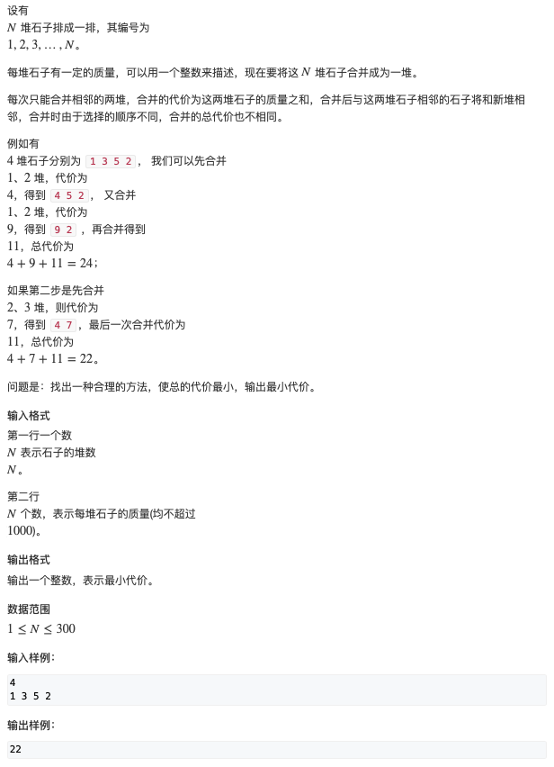

# 区间DP

## 石子合并


- [石子合并](https://www.acwing.com/activity/content/problem/content/1007/)





#### 思路：

- 状态表示：f[i, j]
  - 集合：所有将第 i 堆石子到第 j 堆石子合并成一堆石子的合并方式
  - 属性：min
- 状态计算：以最后一次分类的分界线来分类(一共 k 个, k = j - i + 1)
  - [1, k-1]
  - [2, k-2]
  - [3, k-3]
  - ....
  - [k-1, 1]


```c++
#include <iostream>
#include <algorithm>

using namespace std;

const int N = 310;

int n;
int s[N];
int f[N][N];

int main() {
     
     cin >> n;
     for (int i = 1; i <= n; ++i) cin >> s[i];
     
     // 前缀和
     for (int i = 1; i <= n; ++i) s[i] += s[i-1];
     
     for (int i = 2; i <= n; ++i) {
          for (int j = 1; j + i - 1 <= n; ++j) {
               int l = j, r = j + i - 1;
               f[l][r] = 1e8;
               for (int k = l; k < r; ++k) {
                    f[l][r] = min(f[l][r], f[l][k] + f[k + 1][r] + s[r] - s[l - 1]);
               }
          }
     }
     
     cout << f[1][n] << endl;
     
     return 0;
}
```

