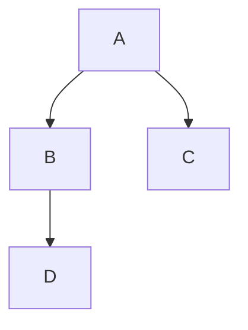

# 数据结构

## 大纲

|      |      |      |
| ---- | ---- | ---- |
|      |      |      |
|      |      |      |
|      |      |      |

### 链表与邻接表

```c++
typedef struct Node{
     int val;
     Node *next;
}Node;
//这种定义链表的方式，面试用的比较多，但是笔试一般不用，因为这种方式需要用new Node()动态创建
//但是new的操作是非常慢的（十万级别的链表），所以一般笔试不采用动态创建的方式
//所以这里采用的方式是拿数组来模拟链表
```

#### 1.单链表(`邻接表`)

//

#### 2.双链表(`优化某些问题`)

//




