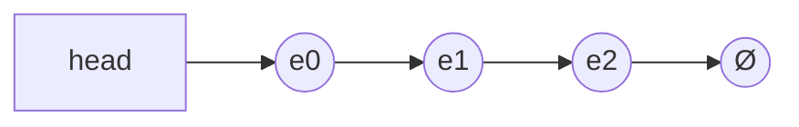
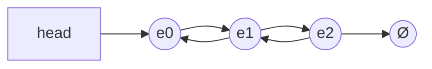
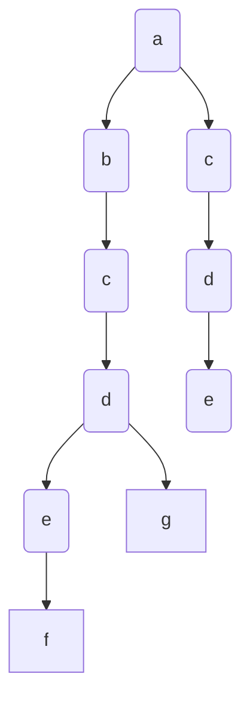
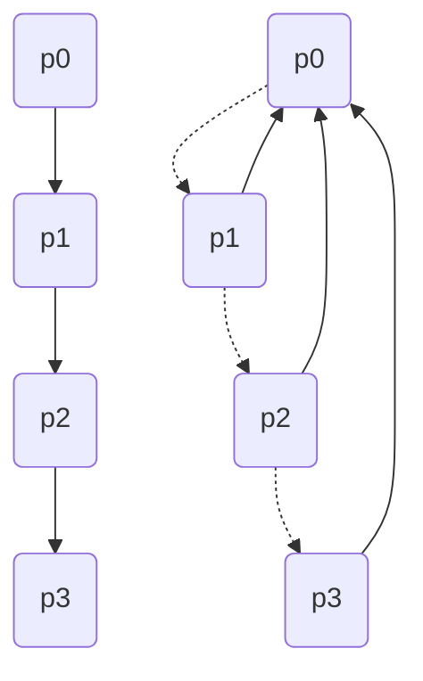

# 数据结构

## 大纲

| 基本内容     |      |      |
| ------------ | ---- | ---- |
| 链表和邻接表 |      |      |
| 栈和队列     |      |      |
|              |      |      |

### 链表与邻接表

```c++
typedef struct Node{
     int val;
     Node *next;
}Node;
//这种定义链表的方式，面试用的比较多，但是笔试一般不用，因为这种方式需要用new Node()动态创建
//但是new的操作是非常慢的（十万级别的链表），所以一般笔试不采用动态创建的方式
//所以这里采用的方式是拿数组来模拟链表
```

#### 1.单链表(`邻接表`)

##### 单链表的基本结构：

单链表的一个节点有两个部分：

- val：储存当前节点的值
- next：储存下一个节点的地址



用`静态数组`来表示链表的示意图：

```markdown
head-->e[0]-->e[1]-->e[2]-->Ø
ne[0] = 1;
ne[1] = 2;
ne[2] = -1(Ø);
```

#### 单链表的操作：

```c++
const int N = 100010;

int head;//
int e[N];//表示节点i的值
int ne[N];//表示节点i的next指针是多少，即：存放下一个节点的下标
int idx;//
```

##### 1.初始化

```c++
void init(){
     head = -1;
     idx = 0
}
```

##### 2.头插(在头指针后面插入节点)

```c++
void add_to_head(int x) {
     e[idx] = x;
     ne[idx] = head;
     head = idx;
     idx++;
}
```

##### 3.常规插入(在中间插入节点)

```c++
//将x插到下标是k的点的后面
void add(int k, int x) {
     e[idx] = x;
     ne[idx] = ne[k];
     ne[k] = idx;
     idx++;
}
```

##### 4.删除

```c++
//将下标k的后面的点删掉
void remove() {
     ne[k] = ne[ne[k]];
}
```

#### 练习题

- ##### 题目描述：

实现一个单链表，链表初始为空，支持三种操作：

1. 向链表头插入一个数；
2. 删除第 k 个插入的数后面的数；
3. 在第 k 个插入的数后插入一个数。

现在要对该链表进行 M 次操作，进行完所有操作后，从头到尾输出整个链表。

**注意**:题目中第 k 个插入的数并不是指当前链表的第 k 个数。例如操作过程中一共插入了 n 个数，则按照插入的时间顺序，这 n 个数依次为：第 1 个插入的数，第 2 个插入的数，…第 n 个插入的数。

**输入格式：**

第一行包含整数 M，表示操作次数。

接下来 M 行，每行包含一个操作命令，操作命令可能为以下几种：

1. `H x`，表示向链表头插入一个数 x。
2. `D k`，表示删除第 k 个插入的数后面的数（当 k 为 0 时，表示删除头结点）。
3. `I k x`，表示在第 k 个插入的数后面插入一个数 x（此操作中 k 均大于 0）。

**输出格式：**

共一行，将整个链表从头到尾输出。

**数据范围：**

1≤M≤100000

所有操作保证合法。

**输入样例：**

```markdown
10
H 9
I 1 1
D 1
D 0
H 6
I 3 6
I 4 5
I 4 5
I 3 4
D 6
```

**输出样例：**

```markdown
6 4 6 5
```

**代码如下：**

```c++
#include <iostream>

using namespace std;

const int N = 100010;

int head, e[N], ne[N], idx;

void init() {
    head = -1;
    idx = 0;
}

void add_to_head(int x) {
    e[idx] = x;
    ne[idx] = head;
    head = idx;
    idx++;
}

void add(int k, int x) {
    e[idx] = x;
    ne[idx] = ne[k];
    ne[k] = idx;
    idx++;
}

void remove(int k) {
    ne[k] = ne[ne[k]];
}

int main() {
     
     ios::sync_with_stdio(false);
     int m;
     cin>>m;

     init();

     while (m--) {
          char op;
          int k, x;
          cin>>op;

          if (op == 'H') {
               cin>>x;
               add_to_head(x);
          }else if (op == 'D') {
               cin>>k;
               if (!k) head = ne[head];//如果删除的头节点
               remove(k - 1);
          }else if (op == 'I') {
               cin>>k>>x;
               add(k - 1, x);
          }
     }

     for (int i = head; i != -1; i = ne[i]) cout<<e[i]<<" ";
     cout<<endl;
     return 0;
}
```


#### 2.双链表(`优化某些问题`)

**双链表的基本结构：**

双链表的基本结构同样主要有两部分组成：

- val：储存当前节点的值
- “next”：储存上一个节点或者下一个节点的地址
  1. 左指针：指向上一个节点
  2. 右指针：指向下一个节点



#### 双链表的操作：（可以用结构体来写链表，但没必要，会使一些基本操作的代码变长）

```c++
#include <iostream>

using namespace std;

const int N = 100010;

//双链表的数据结构
int e[N], l[N], r[N], idx;
```

##### 1.初始化

```c++
void init() {
     r[0] = 1;
     l[1] = 0;
     idx = 2;
}
```

##### 2.插入

```c++
//在下标是k的点的右边插入x
void add(int k, int x) {
     e[idx] = x;
     r[idx] = r[k];
     l[idx] = k;
     l[r[k]] = idx;
     r[k] = idx;
     idx++;
}
```

##### 3.删除

```c++
//删除第k个点
void remove(int k) {
     r[l[k]] = r[k];
     l[r[k]] = l[k];
}
```


#### 3.邻接表（其实就是n个单链表）

- 内容放到第三章图论再详细讲

  

----

### 栈和队列

#### 栈：先进后出

#### 队列：先进先出

#### `用静态数组模拟栈和队列`

#### 1.栈

```c++
#include <iostream>

using namespace std;

const int N = 100010;

int stk[N], tt;

//插入
stk[++tt] = x;
//弹出
tt--;
//判断是否为空
if (tt > 0) not empty;
else empty;
//取出栈顶元素
stk[tt];
```

#### 2.队列

```c++
#include <iostream>

using namespace std;

const int N = 100010;

int q[N], hh, tt = -1;

//插入
q[++tt] = x
//弹出
hh++
//判断是否为空
if (hh <= tt) not empty
    else empty
//取出队首元素
q[hh]
```

- #### 单调栈和单调队列

1. 单调栈：

   单调栈实际上就是栈，只是利用了一些巧妙的逻辑，使得每次新元素入栈后，栈内的元素都保持有序（单调递增或单调递减）。

##### 示例题目：

给定一个长度为 N 的整数数列，输出每个数左边第一个比它小的数，如果不存在则输出 −1。

**输入格式：**

第一行包含整数 N，表示数列长度。

第二行包含 N 个整数，表示整数数列。

**输出格式：**

共一行，包含 N 个整数，其中第 i 个数表示第 i 个数的左边第一个比它小的数，如果不存在则输出 −1。

**数据范围：**

1≤N≤10^5^
1≤数列中元素≤10^9^

**输入样例：**

```markdown
5
3 4 2 7 5
```

**输出样例：**

```markdown
-1 3 -1 2 2
```

**代码如下：**

```c++
#include <iostream>
#include <stdio.h>


using namespace std;

const int N = 100010;

int stk[N], tt = 0;

int main() {
     int n;
     scanf("%d", &n);
     
     for (int i = 0; i < n; i++) {
          int x;
          scanf("%d", &x);
          
          //构造单调递增栈
          while (tt && stk[tt] > x) tt--;
          if (tt) printf("%d ", stk[tt]);
          else printf("-1 ");
          stk[++tt] = x;
     }
     return 0;
}
```


2. 单调队列：

**单调队列**是一种主要用于解决**滑动窗口**类问题的数据结构，即，在长度为 n 的序列中，求每个长度为 m 的区间的区间最值。它的时间复杂度是 O(n) ，在这个问题中比 O(nlog⁡n) 的[ST表](https://zhuanlan.zhihu.com/p/105439034)和[线段树](https://zhuanlan.zhihu.com/p/106118909)要优。

**示例题目：**

给定一个大小为 n≤10^6^ 的数组。

有一个大小为 k 的滑动窗口，它从数组的最左边移动到最右边。

你只能在窗口中看到 k 个数字。

每次滑动窗口向右移动一个位置。

以下是一个例子：

该数组为 `[1 3 -1 -3 5 3 6 7]`，k 为 3。

| 窗口位置            | 最小值 | 最大值 |
| :------------------ | :----- | :----- |
| [1 3 -1] -3 5 3 6 7 | -1     | 3      |
| 1 [3 -1 -3] 5 3 6 7 | -3     | 3      |
| 1 3 [-1 -3 5] 3 6 7 | -3     | 5      |
| 1 3 -1 [-3 5 3] 6 7 | -3     | 5      |
| 1 3 -1 -3 [5 3 6] 7 | 3      | 6      |
| 1 3 -1 -3 5 [3 6 7] | 3      | 7      |

你的任务是确定滑动窗口位于每个位置时，窗口中的最大值和最小值。

#### 输入格式

输入包含两行。

第一行包含两个整数 n 和 k，分别代表数组长度和滑动窗口的长度。

第二行有 n 个整数，代表数组的具体数值。

同行数据之间用空格隔开。

#### 输出格式

输出包含两个。

第一行输出，从左至右，每个位置滑动窗口中的最小值。

第二行输出，从左至右，每个位置滑动窗口中的最大值。

#### 输入样例：

```
8 3
1 3 -1 -3 5 3 6 7
```

#### 输出样例：

```
-1 -3 -3 -3 3 3
3 3 5 5 6 7
```

#### 代码如下：

```c++
#include <iostream>

using namespace std;

const int N = 100010;

int a[N], q[N];//q[N]存放a[N]中数值的下标

int main() {
     ios::sync_with_stdio(false);
     int tt = -1, hh = 0;//tt队尾，hh队首
     int n, k;
     cin>>n>>k;
     
     for (int i = 0; i < n; i++) cin>>a[i];
     
     for (int i = 0; i < n; i++) {
          //当队列不为空，且队列中的队首记录的下标不在滑动窗口的范围内（i - q[hh] + 1 > k），则可弹出队首元素
          if (hh <= tt && i - q[hh] + 1 > k) hh++;
          //构造单调递增队列
          //当队列非空，且队首元素所记录的下标的元素的值是大于当前下标i的值，则：i的进队会破坏单调性，所以弹出队列中所有比它大的元素
          while (hh <= tt && a[q[tt]] >= a[i]) tt--;
          //进队
          q[++tt] = i;
          //当滑动窗口滑过的范围大于k时，表示此时滑动窗口覆盖的数已经达到k
          if (i + 1 >= k) cout<<a[q[hh]]<<" ";
     }
     cout<<endl;
     tt = -1, hh = 0;
     for (int i = 0; i < n; i++) {
          if (hh <= tt && i- q[hh] + 1 > k) hh++;
          //构造单调递减队列
          while (hh <= tt && a[q[tt]] <= a[i]) tt--;
          q[++tt] = i;
          if (i + 1 >= k) cout<<a[q[hh]]<<" ";
     }
     cout<<endl;
     return 0;
}
```


----

### KMP算法

##### KMP算法是一种字符串匹配算法，可以在 O(n+m) 的时间复杂度内实现两个字符串的匹配。

- **朴素暴力匹配法：**

  

```c++
//n指主串s长度，m指模式串p长度
for (int i = 1; i <= n; i++) {
     bool flag = true;
     for (int j = 1; j <= m; j++) {
          if (s[i] != s[j]) {
               flag = false;
               break;
          }  
     }
}
//时间复杂度O(n*m)
```


- ##### KMP

##### 难点：`next数组`

- #### next数组：储存模式串中前缀和后缀相等最大长度

- **"前缀"指除了最后一个字符以外，一个字符串的全部头部组合；"后缀"指除了第一个字符以外，一个字符串的全部尾部组合。**

看看next数组是怎么计算的？

```c++
如：ababababa
       ｜                      |
       a  b  a  b  a  b  a  b  a 
next[1] = 0;next[2] = 0;next[3] = 1;next[4] = 2;next[5] = 3;next[6] = 4;next[7] = 5;next[8] = 6;ext[9] = 6;
```


#### 代码实现：

##### 1. 如何建立next数组：

**其实，求next数组的过程完全可以看成字符串匹配的过程，即以模式字符串为主字符串，以模式字符串的前缀为目标字符串，一旦字符串匹配成功，那么当前的next值就是匹配成功的字符串的长度。**

**具体来说，就是从模式字符串的==第一位==(注意，不包括第0位)开始对自身进行匹配运算。 在任一位置，能匹配的最长长度就是当前位置的next值。**


```c++
//(注意：这里主串字符串的下标从1开始),i从2开始因为next[1] == 0
//j表示
//s[]表示主串, p[]表示模式串, n表示模式串的长度，m表示主串的长度
//ne[]表示next数组
for (int i = 2, j = 0; i <= n; i++) {
     while (j && p[i] != p[j + 1]) j = ne[j];
     if (p[i] == p[j + 1]) j++;
     ne[i] = j;
}
```


##### 2. 如何利用next数组优化字符串匹配：

```c++
for (int i = 1, j = 0; i <= m; i++) {
     while (j && s[i] != p[j + 1]) j = ne[j];
     if (s[i] == p[j + 1]) j++;
     if (j == n) {
          printf("%d", i - n);
          j = ne[j];
     }
}
```


#### 示例题目

给定一个字符串 S，以及一个模式串 P，所有字符串中只包含大小写英文字母以及阿拉伯数字。

模式串 P 在字符串 S 中多次作为子串出现。

求出模式串 P 在字符串 S 中所有出现的位置的起始下标。

#### 输入格式

第一行输入整数 N，表示字符串 P 的长度。

第二行输入字符串 P。

第三行输入整数 M，表示字符串 S 的长度。

第四行输入字符串 S

#### 输出格式

共一行，输出所有出现位置的起始下标（下标从 0 开始计数），整数之间用空格隔开。

#### 数据范围

1≤N≤10^5^
1≤M≤10^6^

#### 输入样例：

```
3
aba
5
ababa
```

#### 输出样例：

```
0 2
```

#### 代码如下：

```c++
#include <iostream>
using namespace std;
const int N = 100010, M = 1000010;
int n, m;
char p[N], s[M];
int ne[N];

int main() {
     cin >> n >> p + 1 >> m >> s + 1;
     
     //求next数组
     for (int i = 2, j = 0 ; i <= n; i++) {
          while (j && p[i] != p[j + 1]) j = ne[j];
          if (p[i] == p[j + 1]) j++;
          ne[i] = j;
     }
     
     //KMP匹配过程
     for (int i = 1, j = 0 ; i <= m; i++) {
          while (j && s[i] != p[j + 1]) j = ne[j];
          if (s[i] == p[j + 1]) j++;
          if (j == n) {
               printf("%d ", i - n);
               j = ne[j];
          }
     }
     return 0;
}
```


----


### Trie树

#### 高效地存储和查找字符串集合的数据结构

#### 如：储存字符串abcdef,abcdg,acde




//


### 并查集

**1.将两个集合合并**

**2.询问两个元素是否在一个集合当中**

近乎O(1)的复杂度完成以上两个操作

- ##### 基本原理：树的形式维护集合，树根的编号就是集合的编号。每个节点存储它的夫节点，p[x]表示x的父节点。

##### 问题1：如何判断树根：if(p[x] == x)

###### 问题2：如何求x集合的编号：while (p[x] != x) x = p[x]; 

###### 问题3：如何合并两个集合：px是x集合的编号，py是y集合的编号。p[x] = y

##### 优化：路径压缩

​																正常并查集-->路径优化之后并查集




**示例题目：**

一共有 n 个数，编号是 1∼n，最开始每个数各自在一个集合中。

现在要进行 m 个操作，操作共有两种：

1. `M a b`，将编号为 a 和 b 的两个数所在的集合合并，如果两个数已经在同一个集合中，则忽略这个操作；
2. `Q a b`，询问编号为 a 和 b 的两个数是否在同一个集合中；

#### 输入格式

第一行输入整数 n 和 m。

接下来 m 行，每行包含一个操作指令，指令为 `M a b` 或 `Q a b` 中的一种。

#### 输出格式

对于每个询问指令 `Q a b`，都要输出一个结果，如果 a 和 b 在同一集合内，则输出 `Yes`，否则输出 `No`。

每个结果占一行。

#### 数据范围

1≤n,m≤10^5^

#### 输入样例：

```
4 5
M 1 2
M 3 4
Q 1 2
Q 1 3
Q 3 4
```

#### 输出样例：

```
Yes
No
Yes
```

**代码如下：**

```c++
#include <iostream>

using namespace std;

const int N = 100010;

int n,m;
int p[N];//p[x]存放x的父节点

int find(int x) {//返回x的祖宗节点 + 路径优化
     while (p[x] != x) p[x] = find(p[x]);
     return p[x];
}

int main() {
     
     scanf("%d%d", &n, &m);
     
     for (int i = 1; i <= n; i++) p[i] = i;
     
     while (m--) {
          char op[2];
          scanf("%s%d%d", op, &a, &b);//注意：用字符串来储存字符可以避免存入空格符
          
          if (op[0] == 'M') p[find(a)] = find(b);
          else {//op = Q
               if (find(a) == find(b)) puts("YES");
               else puts("NO");
          }
     }
     return 0;
}
```

