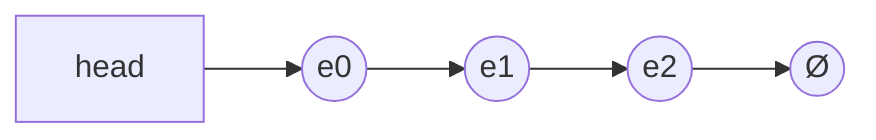
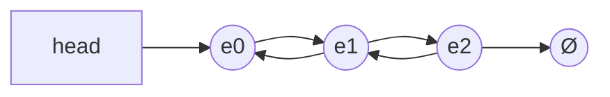
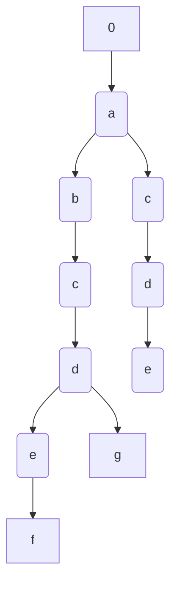
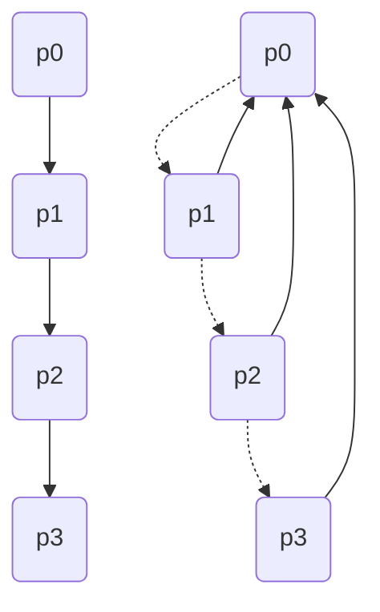
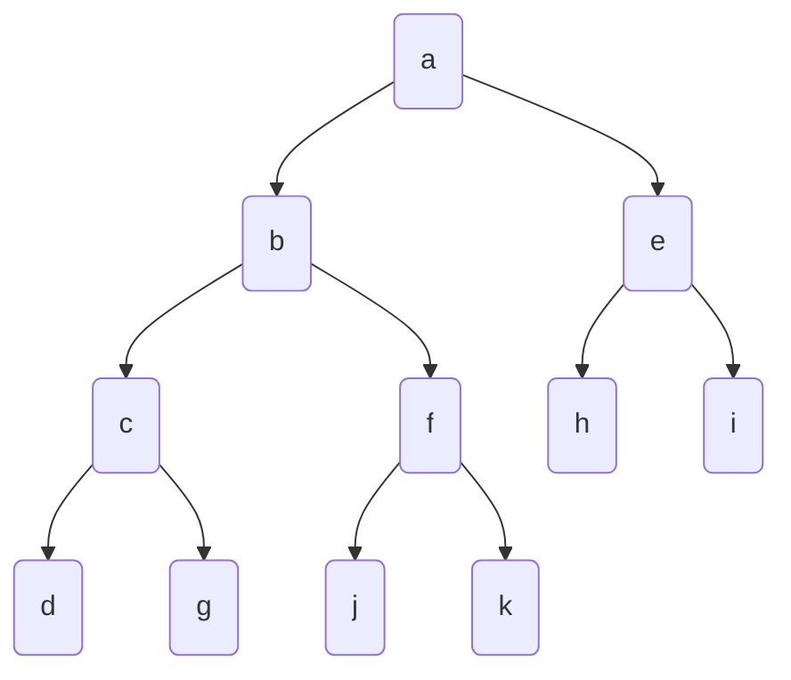

# 数据结构


### 链表与邻接表

```c++
typedef struct Node{
     int val;
     Node *next;
}Node;
//这种定义链表的方式，面试用的比较多，但是笔试一般不用，因为这种方式需要用new Node()动态创建
//但是new的操作是非常慢的（十万级别的链表），所以一般笔试不采用动态创建的方式
//所以这里采用的方式是拿数组来模拟链表
```

#### 1.单链表(`邻接表`)

##### 单链表的基本结构：

单链表的一个节点有两个部分：

- val：储存当前节点的值
- next：储存下一个节点的地址



用`静态数组`来表示链表的示意图：

```markdown
head-->e[0]-->e[1]-->e[2]-->Ø
ne[0] = 1;
ne[1] = 2;
ne[2] = -1(Ø);
```

#### 单链表的操作：

```c++
const int N = 100010;

int head;//
int e[N];//表示节点i的值
int ne[N];//表示节点i的next指针是多少，即：存放下一个节点的下标
int idx;//
```

##### 1.初始化

```c++
void init(){
     head = -1;
     idx = 0
}
```

##### 2.头插(在头指针后面插入节点)

```c++
void add_to_head(int x) {
     e[idx] = x;
     ne[idx] = head;
     head = idx;
     idx++;
}
```

##### 3.常规插入(在中间插入节点)

```c++
//将x插到下标是k的点的后面
void add(int k, int x) {
     e[idx] = x;
     ne[idx] = ne[k];
     ne[k] = idx;
     idx++;
}
```

##### 4.删除

```c++
//将下标k的后面的点删掉
void remove() {
     ne[k] = ne[ne[k]];
}
```

#### 练习题

- ##### 题目描述：

实现一个单链表，链表初始为空，支持三种操作：

1. 向链表头插入一个数；
2. 删除第 k 个插入的数后面的数；
3. 在第 k 个插入的数后插入一个数。

现在要对该链表进行 M 次操作，进行完所有操作后，从头到尾输出整个链表。

**注意**:题目中第 k 个插入的数并不是指当前链表的第 k 个数。例如操作过程中一共插入了 n 个数，则按照插入的时间顺序，这 n 个数依次为：第 1 个插入的数，第 2 个插入的数，…第 n 个插入的数。

**输入格式：**

第一行包含整数 M，表示操作次数。

接下来 M 行，每行包含一个操作命令，操作命令可能为以下几种：

1. `H x`，表示向链表头插入一个数 x。
2. `D k`，表示删除第 k 个插入的数后面的数（当 k 为 0 时，表示删除头结点）。
3. `I k x`，表示在第 k 个插入的数后面插入一个数 x（此操作中 k 均大于 0）。

**输出格式：**

共一行，将整个链表从头到尾输出。

**数据范围：**

1≤M≤100000

所有操作保证合法。

**输入样例：**

```markdown
10
H 9
I 1 1
D 1
D 0
H 6
I 3 6
I 4 5
I 4 5
I 3 4
D 6
```

**输出样例：**

```markdown
6 4 6 5
```

**代码如下：**

```c++
#include <iostream>

using namespace std;

const int N = 100010;

int head, e[N], ne[N], idx;

void init() {
    head = -1;
    idx = 0;
}

void add_to_head(int x) {
    e[idx] = x;
    ne[idx] = head;
    head = idx;
    idx++;
}

void add(int k, int x) {
    e[idx] = x;
    ne[idx] = ne[k];
    ne[k] = idx;
    idx++;
}

void remove(int k) {
    ne[k] = ne[ne[k]];
}

int main() {
     
     ios::sync_with_stdio(false);
     int m;
     cin>>m;

     init();

     while (m--) {
          char op;
          int k, x;
          cin>>op;

          if (op == 'H') {
               cin>>x;
               add_to_head(x);
          }else if (op == 'D') {
               cin>>k;
               if (!k) head = ne[head];//如果删除的头节点
               remove(k - 1);
          }else if (op == 'I') {
               cin>>k>>x;
               add(k - 1, x);
          }
     }

     for (int i = head; i != -1; i = ne[i]) cout<<e[i]<<" ";
     cout<<endl;
     return 0;
}
```


#### 2.双链表(`优化某些问题`)

**双链表的基本结构：**

双链表的基本结构同样主要有两部分组成：

- val：储存当前节点的值
- “next”：储存上一个节点或者下一个节点的地址
  1. 左指针：指向上一个节点
  2. 右指针：指向下一个节点



#### 双链表的操作：（可以用结构体来写链表，但没必要，会使一些基本操作的代码变长）

```c++
#include <iostream>

using namespace std;

const int N = 100010;

//双链表的数据结构
int e[N], l[N], r[N], idx;
```

##### 1.初始化

```c++
void init() {
     r[0] = 1;
     l[1] = 0;
     idx = 2;
}
```

##### 2.插入

```c++
//在下标是k的点的右边插入x
void add(int k, int x) {
     e[idx] = x;
     r[idx] = r[k];
     l[idx] = k;
     l[r[k]] = idx;
     r[k] = idx;
     idx++;
}
```

##### 3.删除

```c++
//删除第k个点
void remove(int k) {
     r[l[k]] = r[k];
     l[r[k]] = l[k];
}
```


#### 3.邻接表（其实就是n个单链表）

- 内容放到第三章图论再详细讲

  

----

### 栈和队列

#### 栈：先进后出

#### 队列：先进先出

#### `用静态数组模拟栈和队列`

#### 1.栈

```c++
#include <iostream>

using namespace std;

const int N = 100010;

int stk[N], tt;

//插入
stk[++tt] = x;
//弹出
tt--;
//判断是否为空
if (tt > 0) not empty;
else empty;
//取出栈顶元素
stk[tt];
```

#### 2.队列

```c++
#include <iostream>

using namespace std;

const int N = 100010;

int q[N], hh, tt = -1;

//插入
q[++tt] = x
//弹出
hh++
//判断是否为空
if (hh <= tt) not empty
    else empty
//取出队首元素
q[hh]
```

- #### 单调栈和单调队列

1. 单调栈：

   单调栈实际上就是栈，只是利用了一些巧妙的逻辑，使得每次新元素入栈后，栈内的元素都保持有序（单调递增或单调递减）。

##### 示例题目：

给定一个长度为 N 的整数数列，输出每个数左边第一个比它小的数，如果不存在则输出 −1。

**输入格式：**

第一行包含整数 N，表示数列长度。

第二行包含 N 个整数，表示整数数列。

**输出格式：**

共一行，包含 N 个整数，其中第 i 个数表示第 i 个数的左边第一个比它小的数，如果不存在则输出 −1。

**数据范围：**

1≤N≤10^5^
1≤数列中元素≤10^9^

**输入样例：**

```markdown
5
3 4 2 7 5
```

**输出样例：**

```markdown
-1 3 -1 2 2
```

**代码如下：**

```c++
#include <iostream>
#include <stdio.h>


using namespace std;

const int N = 100010;

int stk[N], tt = 0;

int main() {
     int n;
     scanf("%d", &n);
     
     for (int i = 0; i < n; i++) {
          int x;
          scanf("%d", &x);
          
          //构造单调递增栈
          while (tt && stk[tt] > x) tt--;
          if (tt) printf("%d ", stk[tt]);
          else printf("-1 ");
          stk[++tt] = x;
     }
     return 0;
}
```


2. 单调队列：

**单调队列**是一种主要用于解决**滑动窗口**类问题的数据结构，即，在长度为 n 的序列中，求每个长度为 m 的区间的区间最值。它的时间复杂度是 O(n) ，在这个问题中比 O(nlog⁡n) 的[ST表](https://zhuanlan.zhihu.com/p/105439034)和[线段树](https://zhuanlan.zhihu.com/p/106118909)要优。

**示例题目：**

给定一个大小为 n≤10^6^ 的数组。

有一个大小为 k 的滑动窗口，它从数组的最左边移动到最右边。

你只能在窗口中看到 k 个数字。

每次滑动窗口向右移动一个位置。

以下是一个例子：

该数组为 `[1 3 -1 -3 5 3 6 7]`，k 为 3。

| 窗口位置            | 最小值 | 最大值 |
| :------------------ | :----- | :----- |
| [1 3 -1] -3 5 3 6 7 | -1     | 3      |
| 1 [3 -1 -3] 5 3 6 7 | -3     | 3      |
| 1 3 [-1 -3 5] 3 6 7 | -3     | 5      |
| 1 3 -1 [-3 5 3] 6 7 | -3     | 5      |
| 1 3 -1 -3 [5 3 6] 7 | 3      | 6      |
| 1 3 -1 -3 5 [3 6 7] | 3      | 7      |

你的任务是确定滑动窗口位于每个位置时，窗口中的最大值和最小值。

#### 输入格式

输入包含两行。

第一行包含两个整数 n 和 k，分别代表数组长度和滑动窗口的长度。

第二行有 n 个整数，代表数组的具体数值。

同行数据之间用空格隔开。

#### 输出格式

输出包含两个。

第一行输出，从左至右，每个位置滑动窗口中的最小值。

第二行输出，从左至右，每个位置滑动窗口中的最大值。

#### 输入样例：

```
8 3
1 3 -1 -3 5 3 6 7
```

#### 输出样例：

```
-1 -3 -3 -3 3 3
3 3 5 5 6 7
```

#### 代码如下：

```c++
#include <iostream>

using namespace std;

const int N = 100010;

int a[N], q[N];//q[N]存放a[N]中数值的下标

int main() {
     ios::sync_with_stdio(false);
     int tt = -1, hh = 0;//tt队尾，hh队首
     int n, k;
     cin>>n>>k;
     
     for (int i = 0; i < n; i++) cin>>a[i];
     
     for (int i = 0; i < n; i++) {
          //当队列不为空，且队列中的队首记录的下标不在滑动窗口的范围内（i - q[hh] + 1 > k），则可弹出队首元素
          if (hh <= tt && i - q[hh] + 1 > k) hh++;
          //构造单调递增队列
          //当队列非空，且队首元素所记录的下标的元素的值是大于当前下标i的值，则：i的进队会破坏单调性，所以弹出队列中所有比它大的元素
          while (hh <= tt && a[q[tt]] >= a[i]) tt--;
          //进队
          q[++tt] = i;
          //当滑动窗口滑过的范围大于k时，表示此时滑动窗口覆盖的数已经达到k
          if (i + 1 >= k) cout<<a[q[hh]]<<" ";
     }
     cout<<endl;
     tt = -1, hh = 0;
     for (int i = 0; i < n; i++) {
          if (hh <= tt && i- q[hh] + 1 > k) hh++;
          //构造单调递减队列
          while (hh <= tt && a[q[tt]] <= a[i]) tt--;
          q[++tt] = i;
          if (i + 1 >= k) cout<<a[q[hh]]<<" ";
     }
     cout<<endl;
     return 0;
}
```


----

### KMP算法

##### KMP算法是一种字符串匹配算法，可以在 O(n+m) 的时间复杂度内实现两个字符串的匹配。

- **朴素暴力匹配法：**

  

```c++
//n指主串s长度，m指模式串p长度
for (int i = 1; i <= n; i++) {
     bool flag = true;
     for (int j = 1; j <= m; j++) {
          if (s[i] != s[j]) {
               flag = false;
               break;
          }  
     }
}
//时间复杂度O(n*m)
```


- ##### KMP

##### 难点：`next数组`

- #### next数组：储存模式串中前缀和后缀相等最大长度

- **"前缀"指除了最后一个字符以外，一个字符串的全部头部组合；"后缀"指除了第一个字符以外，一个字符串的全部尾部组合。**

看看next数组是怎么计算的？

```c++
如：ababababa
       ｜                      |
       a  b  a  b  a  b  a  b  a 
next[1] = 0;next[2] = 0;next[3] = 1;next[4] = 2;next[5] = 3;next[6] = 4;next[7] = 5;next[8] = 6;ext[9] = 6;
```


#### 代码实现：

##### 1. 如何建立next数组：

**其实，求next数组的过程完全可以看成字符串匹配的过程，即以模式字符串为主字符串，以模式字符串的前缀为目标字符串，一旦字符串匹配成功，那么当前的next值就是匹配成功的字符串的长度。**

**具体来说，就是从模式字符串的==第一位==(注意，不包括第0位)开始对自身进行匹配运算。 在任一位置，能匹配的最长长度就是当前位置的next值。**


```c++
//(注意：这里主串字符串的下标从1开始),i从2开始因为next[1] == 0
//j表示
//s[]表示主串, p[]表示模式串, n表示模式串的长度，m表示主串的长度
//ne[]表示next数组
for (int i = 2, j = 0; i <= n; i++) {
     while (j && p[i] != p[j + 1]) j = ne[j];
     if (p[i] == p[j + 1]) j++;
     ne[i] = j;
}
```


##### 2. 如何利用next数组优化字符串匹配：

```c++
for (int i = 1, j = 0; i <= m; i++) {
     while (j && s[i] != p[j + 1]) j = ne[j];
     if (s[i] == p[j + 1]) j++;
     if (j == n) {
          printf("%d", i - n);
          j = ne[j];
     }
}
```


#### 示例题目

给定一个字符串 S，以及一个模式串 P，所有字符串中只包含大小写英文字母以及阿拉伯数字。

模式串 P 在字符串 S 中多次作为子串出现。

求出模式串 P 在字符串 S 中所有出现的位置的起始下标。

#### 输入格式

第一行输入整数 N，表示字符串 P 的长度。

第二行输入字符串 P。

第三行输入整数 M，表示字符串 S 的长度。

第四行输入字符串 S

#### 输出格式

共一行，输出所有出现位置的起始下标（下标从 0 开始计数），整数之间用空格隔开。

#### 数据范围

1≤N≤10^5^
1≤M≤10^6^

#### 输入样例：

```
3
aba
5
ababa
```

#### 输出样例：

```
0 2
```

#### 代码如下：

```c++
#include <iostream>
using namespace std;
const int N = 100010, M = 1000010;
int n, m;
char p[N], s[M];
int ne[N];

int main() {
     cin >> n >> p + 1 >> m >> s + 1;
     
     //求next数组
     for (int i = 2, j = 0 ; i <= n; i++) {
          while (j && p[i] != p[j + 1]) j = ne[j];
          if (p[i] == p[j + 1]) j++;
          ne[i] = j;
     }
     
     //KMP匹配过程
     for (int i = 1, j = 0 ; i <= m; i++) {
          while (j && s[i] != p[j + 1]) j = ne[j];
          if (s[i] == p[j + 1]) j++;
          if (j == n) {
               printf("%d ", i - n);
               j = ne[j];
          }
     }
     return 0;
}
```


----


### Trie树

#### 高效地存储和查找字符串集合的数据结构

#### 如：储存字符串abcdef,abcdg,acde




**示例题目：**

维护一个字符串集合，支持两种操作：

1. `I x` 向集合中插入一个字符串 x；
2. `Q x` 询问一个字符串在集合中出现了多少次。

共有 N 个操作，输入的字符串总长度不超过 10^5^，字符串仅包含小写英文字母。

#### 输入格式

第一行包含整数 N，表示操作数。

接下来 N 行，每行包含一个操作指令，指令为 `I x` 或 `Q x` 中的一种。

#### 输出格式

对于每个询问指令 `Q x`，都要输出一个整数作为结果，表示 x 在集合中出现的次数。

每个结果占一行。

#### 数据范围

1≤N≤2*10^4^

#### 输入样例：

```
5
I abc
Q abc
Q ab
I ab
Q ab
```

#### 输出样例：

```
1
0
1
```

**代码如下：**

```c++
#include <iostream>

using namespace std;

const int N = 100010;

int son[N][26], cnt[N], idx;
//son[N][26]储存的是儿子节点的下标
char str[N];

void insert(char *str) {
     int p = 0;
     for (int i = 0; str[i]; i++) {
          int u = str[i] - 'a';
          if (!son[p][u]) son[p][u] = ++idx;
          p = son[p][u];
     }
     cnt[p]++;
}

int query(char *str) {
     int p = 0;
     for (int i = 0; str[i]; i++) {
          int u = str[i] - 'a';
          if (!son[p][u]) return 0;
          p = son[p][u];
     }
     return cnt[p];
}

int main() {
     int n;
     cin>>n;
     
     while (n--) {
          char op[2];
          scanf("%s%s", op, str);
          if (*op == 'I') insert(str);
          else printf("%d\n", query(str));
     }
     return 0;
}
```


----


### 并查集

**1.将两个集合合并**

**2.询问两个元素是否在一个集合当中**

近乎O(1)的复杂度完成以上两个操作

- ##### 基本原理：树的形式维护集合，树根的编号就是集合的编号。每个节点存储它的夫节点，p[x]表示x的父节点。

##### 问题1：如何判断树根：if(p[x] == x)

###### 问题2：如何求x集合的编号：while (p[x] != x) x = p[x]; 

###### 问题3：如何合并两个集合：px是x集合的编号，py是y集合的编号。p[x] = y

##### 优化：路径压缩

​																正常并查集-->路径优化之后并查集




**示例题目1：**

一共有 n 个数，编号是 1∼n，最开始每个数各自在一个集合中。

现在要进行 m 个操作，操作共有两种：

1. `M a b`，将编号为 a 和 b 的两个数所在的集合合并，如果两个数已经在同一个集合中，则忽略这个操作；
2. `Q a b`，询问编号为 a 和 b 的两个数是否在同一个集合中；

#### 输入格式

第一行输入整数 n 和 m。

接下来 m 行，每行包含一个操作指令，指令为 `M a b` 或 `Q a b` 中的一种。

#### 输出格式

对于每个询问指令 `Q a b`，都要输出一个结果，如果 a 和 b 在同一集合内，则输出 `Yes`，否则输出 `No`。

每个结果占一行。

#### 数据范围

1≤n,m≤10^5^

#### 输入样例：

```
4 5
M 1 2
M 3 4
Q 1 2
Q 1 3
Q 3 4
```

#### 输出样例：

```
Yes
No
Yes
```

**代码如下：**

```c++
#include <iostream>

using namespace std;

const int N = 100010;

int n,m;
int p[N];//p[x]存放x的父节点

int find(int x) {//返回x的祖宗节点 + 路径优化
     if (p[x] != x) p[x] = find(p[x]);
     return p[x];
}

int main() {
     
     scanf("%d%d", &n, &m);
     
     for (int i = 1; i <= n; i++) p[i] = i;
     
     while (m--) {
          char op[2];
          int a, b;
          scanf("%s%d%d", op, &a, &b);//注意：用字符串来储存字符可以避免存入空格符
          
          if (op[0] == 'M') p[find(a)] = find(b);
          else {//op = Q
               if (find(a) == find(b)) puts("Yes");
               else puts("No");
          }
     }
     return 0;
}
```


**示例题目2：**

给定一个包含 n 个点（编号为 1∼n）的无向图，初始时图中没有边。

现在要进行 m 个操作，操作共有三种：

1. `C a b`，在点 a 和点 b 之间连一条边，a 和 b 可能相等；
2. `Q1 a b`，询问点 a 和点 b 是否在同一个连通块中，a 和 b 可能相等；
3. `Q2 a`，询问点 a 所在连通块中点的数量；

#### 输入格式

第一行输入整数 n 和 m。

接下来 m 行，每行包含一个操作指令，指令为 `C a b`，`Q1 a b` 或 `Q2 a` 中的一种。

#### 输出格式

对于每个询问指令 `Q1 a b`，如果 a 和 b 在同一个连通块中，则输出 `Yes`，否则输出 `No`。

对于每个询问指令 `Q2 a`，输出一个整数表示点 a 所在连通块中点的数量

每个结果占一行。

#### 数据范围

1≤n,m≤10^5^

#### 输入样例：

```
5 5
C 1 2
Q1 1 2
Q2 1
C 2 5
Q2 5
```

#### 输出样例：

```
Yes
2
3
```

##### 代码如下：

```c++
#include <iostream>
using namespace std;

const int N = 100010;
int p[N], size[N];//p[x]存放x的父节点, size[]存放每个集合中点的数量
//只有根节点的size是有意义的

int find(int x) {
     if (p[x] != x) p[x] = find(p[x]);
     return p[x];
}

int main() {
     int n, m;
     cin>>n>>m;
     
     for (int i = 1; i <= n; i++) {
          p[i] = i;
          size[i] = 1;
     }
     
     while (m--) {
          char op[5];
          int a, b;
          scanf("%s", op);
          if (op[0] == 'C') {
               cin>>a>>b;
               a = find(a), b = find(b);
               if (a != b) {  
                    p[a] = b;
                    size[b] += size[a];
               }
          }else if (op[1] == '1') { //query
               cin>>a>>b;
               if (find(a) == find(b)) cout<<"Yes";
               else cout<<"No";
               cout<<endl;
          }else {//Q2
               cin>>a;
               cout<<size[find(a)];
               cout<<endl;
          }
     }
     return 0;
}
```


----


### 堆

#### 关键词：

- ##### 如何手写一个堆？

**（STL支持的操作）**

**1.插入一个数**

**2.求集合当中的最小值**

**3.删除最小值**

**（STL不支持的操作）**

**4.删除任意一个元素**

**5.修改任意一个元素**


####                                                     <center>堆是一颗完全二叉树</center>





- ##### 小根堆/小顶堆：对于所有的节点来说，父节点是最小的，其中，根节点是整棵二叉树最小的

- ##### 大根堆/大顶堆：对于所有的节点来说，父节点是最大的，其中，根节点是整棵二叉树最大的

#### 堆（全新的储存方式）

`静态数组`

- 根节点的下标：1，左儿子的下标：2x，右儿子的下标：2x + 1

- 两个基本的操作down，up

#### 由down和up组成以下的基本操作：

#### 1.插入一个数：heap[++size] = x；up(size)

#### 2.求集合当中的最小值：heap[1]

#### 3.删除最小值：heap[1] = heap[size];size--;down(1)

#### 4.删除任意一个元素：heap[k] = heap[size];size--;down(k);up(k);

#### 5.修改任意一个元素：heap[k] =x;down(k);up(k);


#### 例题：

#### 堆排序：

输入一个长度为 n 的整数数列，从小到大输出前 m 小的数。

#### 输入格式

第一行包含整数 n 和 m。

第二行包含 n 个整数，表示整数数列。

#### 输出格式

共一行，包含 m 个整数，表示整数数列中前 m 小的数。

#### 数据范围

1≤m≤n≤10^5^，
1≤数列中元素≤10^9^

#### 输入样例：

```
5 3
4 5 1 3 2
```

#### 输出样例：

```
1 2 3
```


#### 代码如下：

堆排序主要用到两个操作：1.down 2.删除最小元素

```c++
#include <iostream>

using namespace std;

const int N = 100010;
int h[N], s = 0;


void down(int u) {
     int t = u;
     if (u * 2 <= s && h[u * 2] < h[t]) t = u * 2;
     if (u * 2 + 1 <= s && h[u * 2 + 1] < h[t]) t = u * 2 + 1;
     if (u != t) {
          swap(h[u], h[t]);
          down(t);
     }
}

int main() {
     int n, m;
     cin>>n>>m;
     
     for (int i = 1; i <= n; i++) cin>>h[i];
     s = n;
     //heap化
     for (int i = n / 2; i; i--) down(i); 
     
     while (m--) {
          cout<<h[1]<<" ";
          //down(size)
          h[1] = h[s--];
          down(1);
     }
     
    puts("");
    return 0;
}
```


#### 模拟堆

维护一个集合，初始时集合为空，支持如下几种操作：

1. `I x`，插入一个数 x；
2. `PM`，输出当前集合中的最小值；
3. `DM`，删除当前集合中的最小值（数据保证此时的最小值唯一）；
4. `D k`，删除第 k 个插入的数；
5. `C k x`，修改第 k 个插入的数，将其变为 x；

现在要进行 N 次操作，对于所有第 2 个操作，输出当前集合的最小值。

#### 输入格式

第一行包含整数 N。

接下来 N 行，每行包含一个操作指令，操作指令为 `I x`，`PM`，`DM`，`D k` 或 `C k x` 中的一种。

#### 输出格式

对于每个输出指令 `PM`，输出一个结果，表示当前集合中的最小值。

每个结果占一行。

#### 数据范围

1≤N≤10^5^
−10^9^≤x≤10^9^
数据保证合法。

#### 输入样例：

```
8
I -10
PM
I -10
D 1
C 2 8
I 6
PM
DM
```

#### 输出样例：

```
-10
6
```


#### 代码如下：

```c++
#include <iostream> 
#include <algorithm>
#include <string.h>

using namespace std;

const int N = 10e5 + 10;

int h[N], ph[N], hp[N], cur_size;
//ph[k]-第k个插入的点，它在堆里面的下标
//hp[k]-堆中下标是k的点是第几个插入的
void heap_swap(int a, int b) {
     swap(ph[hp[a]], ph[hp[b]]);
     swap(hp[a], hp[b]);
     swap(h[a], h[b]);
}

void down(int u) {
     int t = u;
     if (u * 2 && h[t] > h[u * 2]) t = u * 2;
     if (u * 2 + 1 && h[t] > h[u * 2 + 1]) t = u * 2 + 1;
     if (t != u) {
          heap_swap(t, u);
          down(t);
     }
}

void up(int u) {
     while (u / 2 && h[u] < h[u / 2]) {
          heap_swap(u, u / 2);
          u = u / 2;
     }
}

int main() {
     int n, m = 0;//m-当前用到第几个数
     cin >> n;
     
     while (n--) {
          char op[5];
          int k, x;
          scanf("%s", op);
          
          if (!strcmp(op, 'I')) {
               cin >> x;
               h[++cur_size] = x;
               ph[++m] = cur_size;
               hp[cur_size] = m;
               up(size);
          }else if (!strcmp(op, 'PM')) cout << h[1] << endl;
          else if (!strcmp(op, 'DM')) {
               heap_swap(1, cur_size--);
               down(1); 
          }else if (!strcmp(op, 'D')) {
               cin >> k;
               k = ph[k];
               swap(k, cur_size--);
               down(k), up(k);
          }else {
               cin >> k >> x;
               h[ph[k]] = x;
               down(ph[k]), up(ph[k]);
          }
     }
     return 0;
}
```


----


### 哈希表

#### 1. 存储结构

根据哈希表处理冲突的解决方式分为：

 1. 开放寻址法

    ##### 补充：0x3f3f3f3f

    ```c++
    /*
         在算法竞赛中，我们常常需要用到设置一个常量用来代表“无穷大”。
    
         比如对于int类型的数，有的人会采用INT_MAX，即0x7fffffff作为无穷大。但是以INT_MAX为无穷大常常面临一个问题，即加一个其他的数会溢出。
    
         而这种情况在动态规划，或者其他一些递推的算法中常常出现，很有可能导致算法出问题。
    
         所以在算法竞赛中，我们常采用0x3f3f3f3f来作为无穷大。0x3f3f3f3f主要有如下好处：
    
         0x3f3f3f3f的十进制为1061109567，和INT_MAX一个数量级，即10^9数量级，而一般场合下的数据都是小于10^9的。
         0x3f3f3f3f * 2 = 2122219134，无穷大相加依然不会溢出。
         可以使用memset(array, 0x3f, sizeof(array))来为数组设初值为0x3f3f3f3f，因为这个数的每个字节都是0x3f。
    */
    
    
    #include <iostream>
    #include <cstring>
    
    using namespace std;
    
    const int N = 200003, null = 0x3f3f3f3f;
    
    int h[N];
    
    //如果k在哈希表中的话，k就是x的下标；如果k不在哈希表中的话，k就是x应该存储的位置。
    int find(int x) {
         int k = (x % N + N) % N;
         while (h[k] != null && h[k] != x) {
              k++;
              if (k == N) k = 0;
         }
         return k;
    }
    
    int main() {
         int n, x;
         char op[2];
         cin >> n;
         
         memset(memset(h, 0x3f, sizeof h);
         
         while (n--) {
              scanf("%s%d", op, &x);
              int k = find(x);
              if (*op == 'I') {
                   h[k] = x;
              }else {
                   if (h[k] != null) puts("Yes");
                   else puts("No");
              }
         }
         return 0;
    }
                
    ```

 2. 拉链法

    


#### 模拟散列表：

维护一个集合，支持如下几种操作：

1. `I x`，插入一个数 x；
2. `Q x`，询问数 x 是否在集合中出现过；

现在要进行 N 次操作，对于每个询问操作输出对应的结果。

#### 输入格式

第一行包含整数 N，表示操作数量。

接下来 N 行，每行包含一个操作指令，操作指令为 `I x`，`Q x` 中的一种。

#### 输出格式

对于每个询问指令 `Q x`，输出一个询问结果，如果 xx 在集合中出现过，则输出 `Yes`，否则输出 `No`。

每个结果占一行。

#### 数据范围

1≤N≤10^5^
−10^9^≤x≤10^9^

#### 输入样例：

```
5
I 1
I 2
I 3
Q 2
Q 5
```

#### 输出样例：

```
Yes
No
```

#### 代码如下：

memset() 在一段内存块中填充某一个给定的值，常用于**较大的对结构体和数组的清零操作**

```c++
#include <iostream>
#include <cstring>

using namespace std;

const int N = 100003;

int h[N];
int e[N], ne[N], idx;

void insert(int x) {
     //x % N + N // + N 是因为 x % N 可能小于零，所以 + N
     int k = (x % N + N) % N;
     e[idx] = x;
     ne[idx] = h[k];
     h[k] = idx++;
}

bool find(int x) {
     int k = (x % N + N) % N;
     for (int i = h[k];i != -1;i = ne[i]) {
          if (e[i] == x) return true;
     }
     return false;
}

int main() {
     int n, x;
     char op[2];
     cin >> n;
     
     memset(memset(h, -1, sizeof h);
     
     while (n--) {
          scanf("%s%d", op, &x);
          if (*op == 'I') {
               insert(x);
          }else {
               if (find(x)) puts("Yes");
               else puts("No");
          }
     }
     return 0;
}
```


#### 2. 字符串哈希方式

字符串前缀哈希法

 1. 如何来定义一个字符串前缀的哈希值？把字符串看成是一个p进制的数

    如：“ABCD”:

    

    "A B C D"

    ​			==>  {(1 * p^3^) + (2 \* p^2^) + (3 \* p^1^) + (4 \* p^0^)} mod Q  -->  映射到 ( 1 ~ Q-1 )

    (1 2 3 4)

    

    (注：1. 一般不能映射成0。 2. 字符串哈希不考虑冲突的情况。 3. 经验值：P进制：p一般取131或13331，Q取2^64^。）

    

2. 这样的字符串哈希方式有什么好处？

   **利用前缀哈希就可以算出任意子串的哈希值。**


​	R~L段的哈希值h[l...r]等于 h[r] - h[l - 1] * p^r-l+1^	

​	则：预处理前缀的哈希值为：(因为相邻前缀之间的距离r-l=0，所以就是P)

​		h[i] - h[i - 1] * P  =  str[i] -->h [i] = h[i - 1] * P  + str[i]


#### 例题：字符串哈希

给定一个长度为 n 的字符串，再给定 m 个询问，每个询问包含四个整数 l1,r1,l2,r2，请你判断 [l1,r1][l1,r1] 和 [l2,r2][l2,r2] 这两个区间所包含的字符串子串是否完全相同。

字符串中只包含大小写英文字母和数字。

#### 输入格式

第一行包含整数 n 和 m，表示字符串长度和询问次数。

第二行包含一个长度为 n 的字符串，字符串中只包含大小写英文字母和数字。

接下来 m 行，每行包含四个整数 l1,r1,l2,r2，表示一次询问所涉及的两个区间。

注意，字符串的位置从 11 开始编号。

#### 输出格式

对于每个询问输出一个结果，如果两个字符串子串完全相同则输出 `Yes`，否则输出 `No`。

每个结果占一行。

#### 数据范围

1≤n,m≤10^5^

#### 输入样例：

```
8 3
aabbaabb
1 3 5 7
1 3 6 8
1 2 1 2
```

#### 输出样例：

```
Yes
No
Yes
```


#### 代码如下：

```c++
#include <iostream>

using namespace std;

const int N = 100010, P = 131;

typedef unsigned long long ULL;

int n, m;
char str[N];
ULL h[N], p[N];//p[]用来处理次方

ULL get(int l, int r) {
     return h[r] - h[l - 1] * p[r - l + 1];
}

int main() {
     
     scanf("%d%d%s", &n, &m, str + 1);
     
     p[0] = 1;
     //算字符串前缀哈希
     for (int i = 1; i <= n; i++) {
          p[i] = p[i - 1] * P;
          //h[0] = 0
          h[i] = h[i - 1] * P + str[i];//预处理前缀的哈希值
          //h[R] - h[L] * p(R-L+1) = h(L...R)
     }
     
     while (m--) {
          int l1,r1,l2,r2;
          scanf("%d%d%d%d", &l1, &r1, &l2, &r2);
          
          if (get(l1, r1) == get(l2, r2)) puts("Yes");
          else puts("No");
     }
}
```

