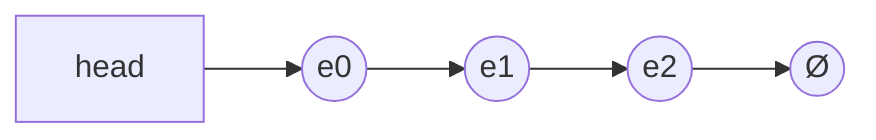

# 数据结构

## 大纲

|      |      |      |
| ---- | ---- | ---- |
|      |      |      |
|      |      |      |
|      |      |      |

### 链表与邻接表

```c++
typedef struct Node{
     int val;
     Node *next;
}Node;
//这种定义链表的方式，面试用的比较多，但是笔试一般不用，因为这种方式需要用new Node()动态创建
//但是new的操作是非常慢的（十万级别的链表），所以一般笔试不采用动态创建的方式
//所以这里采用的方式是拿数组来模拟链表
```

#### 1.单链表(`邻接表`)

##### 链表的基本结构：

链表的一个节点有两个部分：

- val：储存当前节点的值
- next：储存下一个节点的地址



用`静态数组`来表示链表的示意图：

```markdown
head-->e[0]-->e[1]-->e[2]-->Ø
ne[0] = 1;
ne[1] = 2;
ne[2] = -1(Ø);
```

#### 链表的操作：

```c++
const int N = 100010;

int head;//
int e[N];//表示节点i的值
int ne[N];//表示节点i的next指针是多少，即：存放下一个节点的下标
int idx;//
```

##### 1.初始化

```c++
void init(){
     head = -1;
     idx = 0
}
```

##### 2.头插(在头指针后面插入节点)

```c++
void add_to_head(int x) {
     e[idx] = x;
     ne[idx] = head;
     head = idx;
     idx++;
}
```

##### 3.常规插入(在中间插入节点)

```c++
//将x插到下标是k的点的后面
void add(int k, int x) {
     e[idx] = x;
     ne[idx] = ne[k];
     ne[k] = idx;
     idx++;
}
```

##### 4.删除

```c++
//将下标k的后面的点删掉
void remove() {
     ne[k] = ne[ne[k]];
}
```

#### 练习题

- ##### 题目描述：

实现一个单链表，链表初始为空，支持三种操作：

1. 向链表头插入一个数；
2. 删除第 k 个插入的数后面的数；
3. 在第 k 个插入的数后插入一个数。

现在要对该链表进行 M 次操作，进行完所有操作后，从头到尾输出整个链表。

**注意**:题目中第 k 个插入的数并不是指当前链表的第 k 个数。例如操作过程中一共插入了 n 个数，则按照插入的时间顺序，这 n 个数依次为：第 1 个插入的数，第 2 个插入的数，…第 n 个插入的数。

**输入格式：**

第一行包含整数 M，表示操作次数。

接下来 M 行，每行包含一个操作命令，操作命令可能为以下几种：

1. `H x`，表示向链表头插入一个数 x。
2. `D k`，表示删除第 k 个插入的数后面的数（当 k 为 0 时，表示删除头结点）。
3. `I k x`，表示在第 k 个插入的数后面插入一个数 x（此操作中 k 均大于 0）。

**输出格式：**

共一行，将整个链表从头到尾输出。

**数据范围：**

1≤M≤100000

所有操作保证合法。

**输入样例：**

```markdown
10
H 9
I 1 1
D 1
D 0
H 6
I 3 6
I 4 5
I 4 5
I 3 4
D 6
```

**输出样例：**

```markdown
6 4 6 5
```

**代码如下：**

```c++
#include <iostream>

using namespace std;

const int N = 100010;

int head, e[N], ne[N], idx;

void init() {
    head = -1;
    idx = 0;
}

void add_to_head(int x) {
    e[idx] = x;
    ne[idx] = head;
    head = idx;
    idx++;
}

void add(int k, int x) {
    e[idx] = x;
    ne[idx] = ne[k];
    ne[k] = idx;
    idx++;
}

void remove(int k) {
    ne[k] = ne[ne[k]];
}

int main() {
    int m;
    cin>>m;
    
    init();
    
    while (m--) {
        char op;
        int k, x;
        cin>>op;
        
        if (op == 'H') {
            cin>>x;
            add_to_head(x);
        }else if (op == 'D') {
            cin>>k;
            if (!k) head = ne[head];//如果删除的头节点
            remove(k - 1);
        }else if (op == 'I') {
            cin>>k>>x;
            add(k - 1, x);
        }
    }
    
    for (int i = head; i != -1; i = ne[i]) cout<<e[i]<<" ";
    cout<<endl;
    return 0;
}
```


#### 2.双链表(`优化某些问题`)


