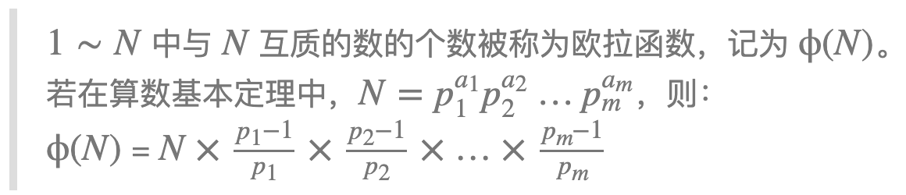
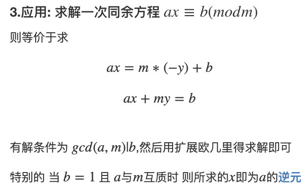

## 质数


- ##### 定义：在大于1的整数中，如果只包含1和本身这两个约数，就被称为质数，或者叫素数。

#### 1. 质数的判定 - 试除法


##### AcWing 866. 试除法判定质数

给定 n 个正整数 ai，判定每个数是否是质数。

输入格式：

第一行包含整数 n。

接下来 n 行，每行包含一个正整数 ai。

输出格式：

共 n 行，其中第 i 行输出第 i 个正整数 ai 是否为质数，是则输出 `Yes`，否则输出 `No`。

数据范围:

1≤n≤100,
1≤ai≤2^31^−1

输入样例：

```markdown
2
2
6
```

输出样例：

```markdown
Yes
No
```


- ##### 朴素方法：O(n)

```c++
bool is_prime(int n) {
     if (n < 2) return false;
     for (int i = 2; i < n; i++) {
          if (n % i == 0) return false;
     }
     return true;
}
```


- ##### 试除法：O(sqrt(n))

一个合数的约数总是成对出现的,如果d|n,那么(n/d)|n,因此我们判断一个数是否为质数的时候,只需要判断较小的那一个数能否整除n就行了,即只需枚举d<=(n/d),即d*d<=n,d<=sqrt(n)就行了.

```c++
bool is_prime(int n) {
     if (n < 2) return false;
     for (int i = 2; i <= n / i; i++) {
          if (n % i == 0) return false;
     }
     return true;
}
```


#### 2. 分解质因数 - 试除法

- 时间复杂度：O(logn)~O(sqrt(n))


```c++
void devide(int n) {
     for (int i = 2; i <= n / i; i++) {
          if (n % i == 0) {
               int s = 0;
               while (n % i == 0) {
                    n /= i;
                    s++
               }
               cout << i << ' ' << s << endl;
          }
     }
     if (n > 1) cout << n << ' ' << 1 << endl;
     cout << endl;
}
```


#### 3. 筛法


**求质数的个数**


- 朴素筛法：O(nlnn) < O(nlogn)


```c++
// 朴素法
void get_primes_simple(int n) {
    for (int i = 2; i <= n; i++) {
        if (!st[i]) primes[cnt++] = i; // 保存质数
        for (int j = i + i; j <= n; j += i) { // 筛掉所有以 i 为倍数的数，它们都不是质数
            st[j] = true;
        }
    }
}

```


- 优化版本 - 埃氏筛法：O(nloglogn) ~= O(n)
  - 只筛选没被筛选的数

##### 质数定理：1 ~ n 当中有  n / lnn 个质数


```c++
// 埃氏晒法
void get_primes_ai(int n) {
    for (int i = 2; i <= n; i++) {
        if (!st[i]) {
            primes[cnt++] = i;
            for (int j = i + i; j <= n; j += i) st[j] = true;
        }
    }
}
```


- 线性（欧式）筛法：线性时间复杂度，更快

  [线性筛法解析1](https://blog.csdn.net/weixin_54285142/article/details/115440779) - 代码有问题，解析没问题

  [解析2](https://blog.csdn.net/qq_40760407/article/details/108654025?spm=1001.2101.3001.6661.1&utm_medium=distribute.pc_relevant_t0.none-task-blog-2~default~CTRLIST~Rate-1-108654025-blog-123587336.pc_relevant_aa2&depth_1-utm_source=distribute.pc_relevant_t0.none-task-blog-2~default~CTRLIST~Rate-1-108654025-blog-123587336.pc_relevant_aa2&utm_relevant_index=1)

  [解析3](https://blog.csdn.net/weixin_52199120/article/details/123658240)

  - ##### n 只会被最小质因子筛掉
  
  - ##### 算法的特点就是每个数只会被自己的最小质因数筛过一次，所以由此保证了线性的时间复杂度。


### 我们筛的每一个数，一定是用我们的最小质因子去筛它。


```c++
void get_primes_linear(int n) {
     for(int i = 2; i <= n; i++) {
          if (!st[i]) primes[cnt++] = i;
          for(int j = 0; primes[j] <= n / i; j++) {
               st[primes[j] * i] = true;
               if (i % primes[j] == 0) break;
          }
     }
}
```


#### 精髓

```c++
if (i % primes[j] == 0) break;
```


##### 完整代码：

```c++
#include <iostream>
#include <algorithm>

using namespace std;

const int N = 1000010;

int primes[N], cnt;
bool st[N];

void get_primes_simple(int n) {
     for(int i = 2; i <= n; i++) {
          if (!st[i]) prime[cnt++] = i;
          for (int j = i + i; j <= n; j += i) st[j] = true;
     }
}

void get_primes_ai(int n) {
     for (int i = 2; i <= n; i++) {
          if (!st[i]) {
               prime[cnt++] = i;
               for (j = i + i; j <= n; j += i) st[j] = true;
          }
     }
}

void get_primes_linear(int n) {
     for (int i = 2; i <= n; i++) {
          if (!st[i]) primes[cnt++] = i;
          for (int j = 0; primes[j] <= n / i; j++) {
               st[primes[j] * i] = true;
               if (i % primes[j] == 0) break;
          }
     }
}

int main() {
     
     int n;
     cin >> n;
     
     get_primes_linear(n);
     
     cout << cnt << endl;
     
     return 0;
}
```


### 运行效率：（从上到下：线性筛法-埃式筛法-朴素法）


## 约数


### 1. 试除法求一个数的所有约数 O(sqrt(n))


##### AcWing 869. 试除法求约数

给定 n 个正整数 ai，对于每个整数 ai，请你按照从小到大的顺序输出它的所有约数。

输入格式:

第一行包含整数 n。

接下来 n 行，每行包含一个整数 ai。

输出格式:

输出共 n 行，其中第 i 行输出第 i 个整数 ai 的所有约数。

数据范围:

1≤n≤100,
2≤ai≤2×10^9^

输入样例：

```markdown
2
6
8
```

输出样例：

```markdown
1 2 3 6 
1 2 4 8 
```


##### 代码：

```c++
#include <iostream>
#include <algorithm>
#include <vector>

using namespace std;

vector<int> get_divisors(int n) {
    
    vector<int> res;
    
    for(int i = 1; i <= n / i; i++) {
        if (n % i == 0) {
            res.push_back(i);
            if (i != n / i) res.push_back(n / i); 
        }
    }
    sort(res.begin(), res.end());
    return res;
}

int main() {
    
    int n;
    cin >> n;
    
    while (n--) {
        int a;
        cin >> a;
        auto res = get_divisors(a);
        for(int i = 0; i < res.size(); i++){
            cout << res[i] << ' ';
        }
        cout << endl;
    }
    return 0;
}
```


### 2. 约数个数


#### [约数个数定理](https://baike.baidu.com/item/%E7%BA%A6%E6%95%B0%E4%B8%AA%E6%95%B0%E5%AE%9A%E7%90%86/4926961?fr=aladdin)


- INT范围内约数最多的数的约数个数大概在1500左右


##### AcWing 870. 约数个数

给定 n 个正整数 ai，请你输出这些数的乘积的约数个数，答案对 10e9+7 取模。

输入格式：
第一行包含整数 n。
接下来 n 行，每行包含一个整数 ai。

输出格式：
输出一个整数，表示所给正整数的乘积的约数个数，答案需对 10e9+7 取模。

数据范围：
1≤n≤100,
1≤ai≤2×10e9
输入样例：

```markdown
3
2
6
8
```

输出样例：

```markdown
12
```


##### 代码：


```c++
#include <iostream>
#include <algorithm>
#include <unordered_map>
#include <vector>

using namespace std;

typedef long long LL; // 数比较大，需要用long long型
const int N = 110, mod = 1e9 + 7;

int main() {
     
     int n;
     cin >> n;
     
     unordered_map<int, int> primes;
     
     while (n--) {
          int x;
          cin >> x;
          
          for (int i = 2; i <= x / i; i++) {
               while (x % i == 0) {
                    x /= i;
                    primes[i]++;
               }
          }
          if (x > 1) primes[x]++;
     }
     
     LL res = 1;
     for (auto p : primes) res = res * (p.second + 1) % mod;
     
     cout << res << endl;
     return 0;
}
```


### 3. 约数之和


#### [约数和定理](https://baike.baidu.com/item/%E7%BA%A6%E6%95%B0%E5%92%8C%E5%AE%9A%E7%90%86/3808428?fr=aladdin)


##### AcWing 871. 约数之和

给定 n 个正整数 ai，请你输出这些数的乘积的约数之和，答案对 10e9+7 取模。

输入格式：
第一行包含整数 n。
接下来 n 行，每行包含一个整数 ai。

输出格式：
输出一个整数，表示所给正整数的乘积的约数之和，答案需对 10e9+7 取模。

数据范围：
1≤n≤100,
1≤ai≤2×10e9
输入样例：

```markdown
3
2
6
8
```

输出样例：

```markdown
252
```


##### 代码：

```c++
#include <iostream>
#include <algorithm>
#include <unordered_map>
#include <vector>

using namespace std;

typedef long long LL; // 数比较大，需要用long long型
const int N = 110, mod = 1e9 + 7;

int main() {
     
     int n;
     cin >> n;
     
     unordered_map<int, int> primes;
     
     while (n--) {
          int x;
          cin >> x;
          
          for (int i = 2; i <= x / i; i++) {
               while (x % i == 0) {
                    x /= i;
                    primes[i]++;
               }
          }
          if (x > 1) primes[x]++;
     }
     
     LL res = 1;
     for (auto p : primes) {
          LL a = p.first, b = p.second;
          LL t = 1;
          while (b--) t = t * (a + 1) % mod;
          res = res * t % mod;
     }
     
     cout << res << endl;
     return 0;
}
```


### 4. 欧几里得算法 / 辗转相除法


- #### [欧几里得算法](https://baike.baidu.com/item/%E6%AC%A7%E5%87%A0%E9%87%8C%E5%BE%97%E7%AE%97%E6%B3%95/1647675)

  - #### gcd(a,b) = gcd(b,a mod b)


##### AcWing 872. 最大公约数

给定 n 对正整数 ai,bi，请你求出每对数的最大公约数。
输入格式:

第一行包含整数 n。

接下来 n 行，每行包含一个整数对 ai,bi。

输出格式:
输出共 n 行，每行输出一个整数对的最大公约数。

数据范围:
1≤n≤10e5,
1≤ai,bi≤2×10e9

输入样例：

```markdown
2
3 6
4 6
```

输出样例：

```markdown
3
2
```


##### 代码：

```c++
#include <iostream>
#include <algorithm>

using namespace std;

int gcd(int a, int b) {
     return b ? gcd(b, a % b) : a;
}

int main() {
     int n;
     cin >> n;
     
     while (n--) {
          int a, b;
          cin >> a >> b;
          cout << gcd(a, b) << endl;
     }
     
     return 0;
}
```


## 欧拉函数


- [欧拉函数的定义](https://baike.baidu.com/item/%E6%AC%A7%E6%8B%89%E5%87%BD%E6%95%B0/1944850?fr=aladdin)


#### 证明：容斥原理

[欧拉公式证明](https://blog.csdn.net/weixin_61839423/article/details/123513819)


##### AcWing 873. 欧拉函数

给定 n 个正整数 ai，请你求出每个数的欧拉函数。

欧拉函数的定义




输入格式:
第一行包含整数 n。

接下来 n 行，每行包含一个正整数 ai。

输出格式:
输出共 n 行，每行输出一个正整数 ai 的欧拉函数。

数据范围:
1≤n≤100,
1≤ai≤2×10e9

输入样例：

```markdown
3
3
6
8
```

输出样例：

```markdown
2
2
4
```


##### 代码：


```c++
#include <iostream>
#include <algorithm>

using namespace std;

int main() {
     int n;
     cin >> n;
     
     while (n--) {
          int a;
          cin >> a;
          
          int res = a;
          for (int i = 2; i <= a / i; i++) {
               if (a % i == 0) {
                    res = res / i * (i - 1);
                    while (a % i == 0) a /= i;
               }
          }
          
          if (a > 1) res = res / a * (a - 1);
          
          cout << res << endl;
     }
     
     return 0;
}
```


##### AcWing 874. 筛法求欧拉函数

给定一个正整数 n，求 1∼n 中每个数的欧拉函数之和。

###### 输入格式：

共一行，包含一个整数 n。

输出格式：
共一行，包含一个整数，表示 1∼n 中每个数的欧拉函数之和。

数据范围：
1≤n≤10e6
输入样例：

```markdown
6
```

输出样例：

```markdown
12
```


##### 代码：

```c++
#include <iostream>
#include <algorithm>

typedef long long LL;
using namespace std;

const int n = 1000010;

int primes[N], cnt;
int phi[N];
bool st[N];

LL get_eulers(int n) {
     phi[1] = 1;
     for (int i = 2; i <= n; i++) {
          if (!st[i]) {
               primes[cnt++] = i;
               phi[i] = i - 1;
          }
          for (int j = 0; primes[j] <= n / i; j++) {
               st[primes[j] * i] = true;
               if (i % primes[j] == 0) {
                    phi[primes[j] * i] = phi[i] * primes[j];
                    break;
               }
               phi[i] = phi[i] * (primes[j] - 1);
          }
     }
     
     LL res = 0;
     for (int i = 1; i <= n; i++) res += phi[i];
     
     return res;
}
 


int main() {
     int n;
     cin >> n;
     
     cout << get_eulers(n) << endl;
     
     return 0;
}
```


#### 应用--欧拉定理：

[欧拉定理](https://baike.baidu.com/item/%E6%AC%A7%E6%8B%89%E5%AE%9A%E7%90%86/891345)  


##### 欧拉定理简单推论：费马小定理（当n为质数是，$a^{\varphi(n)}mod(n) \equiv 1 \Rightarrow a^{p-1}mod(p) \equiv 1$）


## 快速幂


- #### 在O(logk)的时间复杂度内，快速的求出$a^k mod(p)$，其中a、p、k 在（1，10e9）范围内


#### 反复平方法：


##### AcWing 875. 快速幂


```c++
#include <iostream>
#include <algorithm>

using namespace std;

typedf long long LL;

LL quick_power(int a, int k, int p) {
     LL res = 1;
     while (k) {
          if (k & 1) {
               res = res * a % p;
               k >>= 1;
               a = a * (LL)a % p; 
          }
     }
     return res;
}

int main() {
     
     int n;
     scanf("%d", &n);
     
     while (n--) {
          int a, k, p;
          scanf("%d%d%d", &a, &k, &p);
          
          print("%lld\n", quick_power(a, k, p));
     }
     
     return 0;
}
```


##### [AcWing 876. 快速幂求逆元](https://www.acwing.com/problem/content/878/)


- 找到 x ，使得 b * x mod(p) = 1 --> b * b^(p-2) (mod p) = 1


#### $b$ 存在乘法逆元的充要条件是 $b$ 与模数 $m$ 互质。当模数 $m$ 为质数时，$b^{m−2}$ 即为 $b$ 的乘法逆元。

 

此题，因为 p 为质数，所以，由费马小定理：

- $b^{p-1} mod(p) \equiv 1$


==> 所以，此题本质上是在求快速幂 $b^{p-2} mod(p)$

```c++
#include <iostream>
#include <algorithm>

using namespace std;

typedef long long LL;

int qmi(int a, int k, int p) {
     LL res = 1;
     while (k) {
          res = res * (LL)a % p;
          k >>= 1;
          a = a * (LL)a % p;
     }
     return res;
}

int main() {
     int n;
     scanf("%d", &n);
     
     while (n--) {
          int a, p;
          scanf("%d%d", &a, &p);
          
          int res = qmi(a, p-2, p);
          
          if(a % p) printf("%d\n", res);
          else puts("impossible");
     }
     return 0;
}
```

 


##### [AcWing 877. 扩展欧几里得算法](https://www.acwing.com/problem/content/879/)


裴蜀定理：对于任意正整数a、b，一定存在非零整数x、y，使得 ax + by = gcd(a, b), gcd表示a、b的最大公约数

 

- [扩展的欧几里得算法](https://www.acwing.com/solution/content/1393/)


```c++
#include <iostream>
#include <algorithm>

using namespace std;

int exgcd(int a, int b, int &x, int &y) {
     if (b == 0) {
          x = 1, y = 0;
          return a;
     }
     int d = exgcd(b, a % b, y, x);
     y -= a / b * x;
}

int mian() {
     int n;
     cin >> n;
     
     while (n--) {
          int a, b, x, y;
          cin >> a >> b;
          
          exgcd(a, b, x, y);
          
          cout << x << " " << y << endl;
     }
     return 0;
}
```


##### [AcWing 878. 线性同余方程](https://www.acwing.com/problem/content/880/)





```c++
#include <iostream>
#include <algorithm>

using namespace std;

int exgcd(int a, int b, int &x, int &y) {
     if (b == 0) {
          x = 1, y = 0;
          return a;
     }
     int d = exgcd(b, a % b, y, x);
     y -= a / b * x;
}

int main() {
     
     int n;
     cin >> n;
     
     while (n--) {
          int a, b, m;
          cin >> a >> b >> m;
          
          int x, y;
          int d = exgcd(a, m, x, y);
          
          if (b % d) puts("impossible");
          else cout << (LL)b / d * x % m << endl;
     }
     
     return 0;
}
```


## 中国剩余定理
