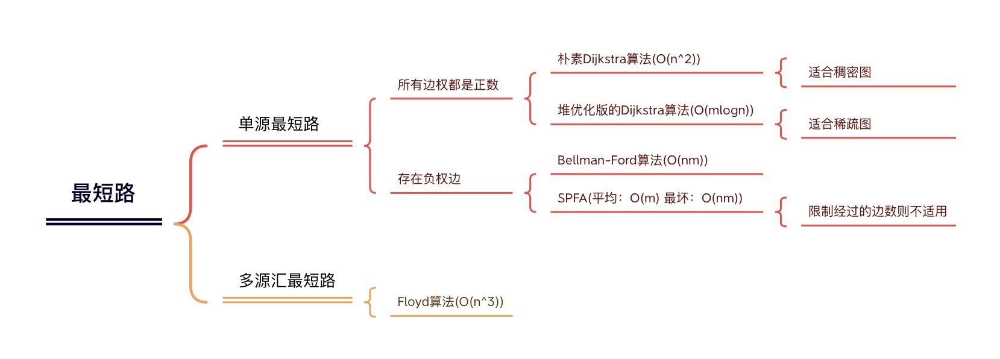
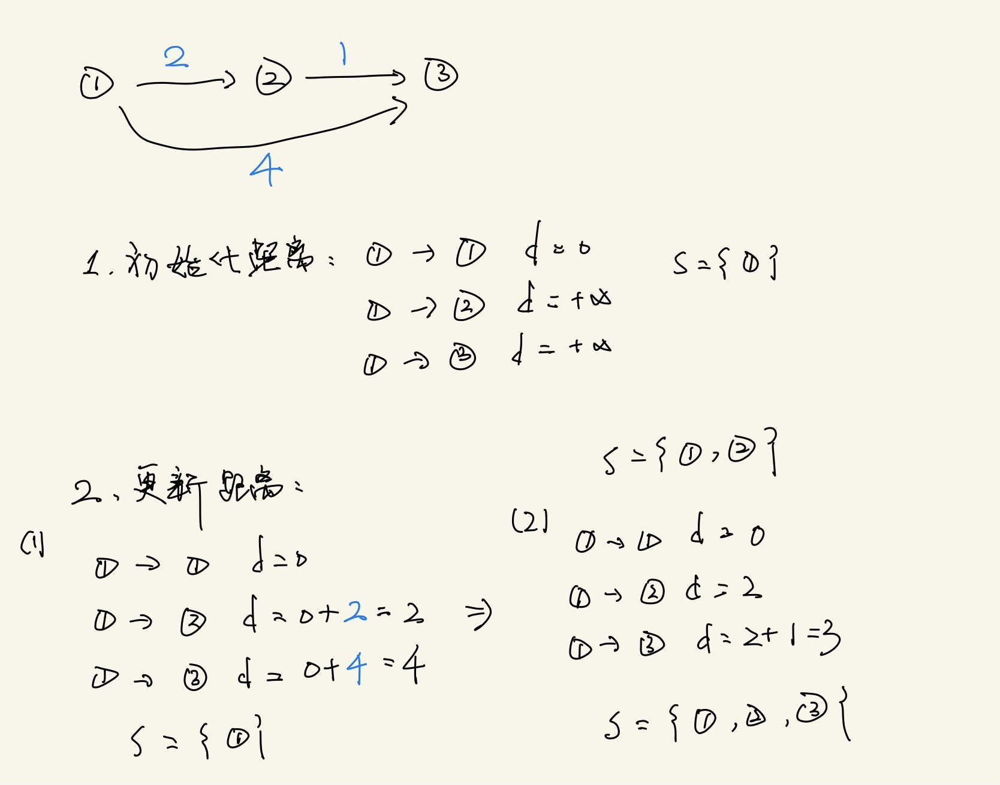

# 最短路问题

- ### 常见的最短路问题：

  - ### 单源最短路：一个点到其他所有点的最短路

  - ### 多源汇最短路：起点终点不确定

#### （源：起点；汇：终点）


- ### 问题思路与难点：建图

（无需考虑图是有向图还是无向图，无向图看作特殊的有向图即可）

#### 如何把问题抽象成最短路问题，怎么定义点和边


### 知识结构：



- ## 单源最短路：

## Dijkstra

迪杰斯特拉算法

### 1. 朴素Dijkstra算法：

- #### 算法思路（贪心算法）：

  （S：当前已确定最短路的点）

  - 初始化距离：dist(1) = 0; dist(i) = +∞
  - for i：1～n
    - t <- 不在S中的，距离最近的点
    - S <- t
    - 用 t 更新其他点的距离


- #### 例子：(稠密图用邻接矩阵来存，稀疏图用邻接表来存)




##### AcWing 849. Dijkstra求最短路 I


给定一个 n 个点 m 条边的有向图，图中可能存在重边和自环，所有边权均为正值。

请你求出 1 号点到 n 号点的最短距离，如果无法从 1 号点走到 n 号点，则输出 −1。

输入格式：

第一行包含整数 n 和 m。

接下来 m 行每行包含三个整数 x,y,z，表示存在一条从点 x 到点 y 的有向边，边长为 z。

输出格式：

输出一个整数，表示 1 号点到 n 号点的最短距离。

如果路径不存在，则输出 −1。

数据范围：

1≤n≤500,

1≤m≤10^5^,

图中涉及边长均不超过10000。

输入样例：

```markdown
3 3
1 2 2
2 3 1
1 3 4
```


输出样例：

```markdown
3
```


[AcWing 849. Dijkstra求最短路 I-解题思路1](https://www.acwing.com/solution/content/5806/)

[AcWing 849. Dijkstra求最短路 I-解题思路2](https://www.acwing.com/solution/content/38318/)

[大佬的解释](https://www.acwing.com/user/myspace/index/196196/)


##### 代码如下：


```c++
#include <iostream>
#include <cstring>
#include <algorithm>

using namespace std;

const int N = 510;

int n, m;

//邻接矩阵
int g[N][N];
int dist[N];
bool st[N];

int dijkstra() {
     //1.初始化距离
     memset(dist, 0x3f, sizeof dist);
     dist[1] = 0;
     //for i : 1 ~ n
     for (int i = 0; i < n; i++) {
          int t = -1; // 将t设置为-1 因为Dijkstra算法适用于不存在负权边的图
          for (int j = 1; j <= n; j++) { 
               if (!st[j] && (t == -1 || dist[t] > dist[j])) { // 该步骤即寻找还未确定最短路的点中路径最短的点
                    t = j;
               }
          }
          for (int j = 1; j <= n; j++) { // 拿着已找到的最小权重的边去更新可达的其他边
               dist[j] = min(dist[j], dist[t] + g[t][j]);
          }
          st[t] = true;
     }
     if (dist[n] == 0x3f3f3f3f) return -1;
     return dist[n];
}

int main() {
     
     cin >> n >> m;
     
     memset(g, 0x3f, sizeof g);
     
     while(m--) {
          int x, y, z;
          cin >> x >> y >> z;
          g[x][y] = min(g[x][y], z);
     }
     
     printf("%d\n", dijkstra());
     
     return 0;
}
```


##### O(n^2^)的算法当数量级达到10^5^会“爆掉”


### 2. 堆优化版的Dijkstra算法：


用堆对朴素版Dijkstra进行优化


----

⬇️ 朴素Dijkstra算法的时间复杂度分析：

（S：当前已确定最短路的点）

初始化距离：dist(1) = 0; dist(i) = +∞      ➡️ O(n)  （1）

- for i：1～n                           
  - t <- 不在S中的，距离最近的点          ➡️ O(n^2^) （2）
    - S <- t                         ➡️ O(n)  （3）
  - 用 t 更新其他点的距离                ➡️ O(nm) （4）

----


- ##### 对整体时间复杂度影响最大的是（2），而（2）是寻找最小的点，则可以考虑用堆结构来优化，如此，（2）的时间复杂度可以优化为O(n)，（4）的时间复杂度可以优化为O(mlogn)


- 堆有两种写法：
  - 手写堆-支持修改任意位置元素
  - 优先队列-c++（存在冗余）


##### AcWing 850. Dijkstra求最短路 II

给定一个 n 个点 m 条边的有向图，图中可能存在重边和自环，所有边权均为非负值。

请你求出 1 号点到 n 号点的最短距离，如果无法从 1 号点走到 n 号点，则输出 −1。

输入格式：

第一行包含整数 n 和 m。

接下来 m 行每行包含三个整数 x,y,z，表示存在一条从点 x 到点 y 的有向边，边长为 z。

输出格式：

输出一个整数，表示 1 号点到 n 号点的最短距离。

如果路径不存在，则输出 −1。

数据范围：

1≤n,m≤1.5×10^5^,

图中涉及边长均不小于 0，且不超过 10000。

数据保证：如果最短路存在，则最短路的长度不超过 109。

输入样例：

```markdown
3 3
1 2 2
2 3 1
1 3 4
```

输出样例：

```markdown
3
```


##### 代码如下：


```c++
#include <iostream>
#include <cstring>
#include <algorithm>
#include <queue>

using namespace std;

typedef pair<int, int> PII;

const int N = 1e6 + 10;
int n, m;

//邻接表
int h[N], w[N], e[N], ne[N], idx;

int dist[N];
bool st[N];

void add(int a, int b, int c) {
     e[idx] = b, w[idx] = c, ne[idx] = h[a], h[a] = idx++;
}

int dijkstra() {
     
     memset(dist, 0x3f, sizeof dist);
     dist[1] = 0;
     
     priority_queue<PII, vector<PII>, greater<PII>> heap;
     heap.push({0, 1});
     
     while(heap.size()) {
          int t = heap.top();
          heap.pop();
          
          int ver = t.second, distance = t.first;
          
          if (st[ver]) continue;
          st[ver] = true;
          
          for(int i = h[ver]; i != -1; i = ne[i]) {
               int j = e[i];
               if (dist[j] > w[i] + dist[ver]) {
                    dist[j] > w[i] + dist[ver];
                    heap.push({dist[j], j});
               }
          }
     }
     if (dist[n] == 0x3f3f3f3f) return -1;
     return dist[n];
}

int main() {
     
     cin >> n >> m;
     
     memset(h, -1, sizeof h);
     
     while (m--) {
          int x, y, z;
          cin >> x >> y >> z;
          add(x, y, z);
     }
     
     cout << dijkstra() << endl;
     
     return 0;
}
```


## Bellman-Ford算法

贝尔曼-福特


- #### 算法思路：

  （两重循环）

  - 初始化距离
  - 第一重循环：for i : 1~n
    - 遍历所有的点

  - 第二重循环：for j : 1~m (松弛操作)

    （注意：每次更新只能用上次--back[] 数组是上一次迭代后 dist[] 数组的备份，由于是每个点同时向外出发，因此需要对 dist[] 数组进行备份，若不进行备份会因此发生串联效应，影响到下一个点）

    - 遍历所有的边 dist[b] = min(dist[b],back[a] + w)

  


- #### 解答汇总：

  - [y总课程问题全记录](https://www.acwing.com/solution/content/14088/)
  - [Bellman-Ford解析](https://www.acwing.com/solution/content/6320/)


##### AcWing 853. 有边数限制的最短路

给定一个 n 个点 m 条边的有向图，图中可能存在重边和自环， **边权可能为负数**

请你求出从 1 号点到 n 号点的最多经过 k 条边的最短距离，如果无法从 1 号点走到 n 号点，输出`impossible`。

注意：图中可能 **存在负权回路** 。

输入格式:

第一行包含三个整数 n,m,k。

接下来 m 行，每行包含三个整数 x,y,z，表示存在一条从点 x 到点 y 的有向边，边长为 z。

点的编号为 1∼n。

输出格式:

输出一个整数，表示从 1 号点到 n 号点的最多经过 k 条边的最短距离。

如果不存在满足条件的路径，则输出` impossible`。

数据范围:

1≤n,k≤500,
1≤m≤10000,
1≤x,y≤n，

任意边长的绝对值不超过 10000。

输入样例：

```markdown
3 3 1
1 2 1
2 3 1
1 3 3
```

输出样例：

```markdown
3
```


```c++
#include <iostream>
#include <cstring>
#include <algorithm>

using namespace std;

const int N = 510, M = 10010;
int n, m, k;

struct Edge {
     int a, b, w;
}edges[M];

int dist[N];
int backup[N];

void bellman_ford() {
     
     memset(dist, 0x3f, sizeof dist);
     dist[1] = 0;
     
     for (int i = 0; i < k; i++) {
          memcpy(backup, dist, sizeof dist);
          for (int j = 0; j < m; j++) {
               auto e = edges[j];
               dist[e.b] = min(dist[e.b], backup[e.a] + e.w);
          }
     }
}

int main() {
     
     cin >> n >> m >> k;
     
     for (int i = 0; i < m; i++) {
          int x, y, z;
          cin >> x >> y >> z;
          edges[i] = {x, y, z}
     }
     
     bellman_ford();
     
     if (dist[n] > 0x3f3f3f3f / 2) puts("impossible");
     else cout << dist[n] << endl;
     
     return 0;
}
```


## SPFA算法


- ## 多源汇最短路：

