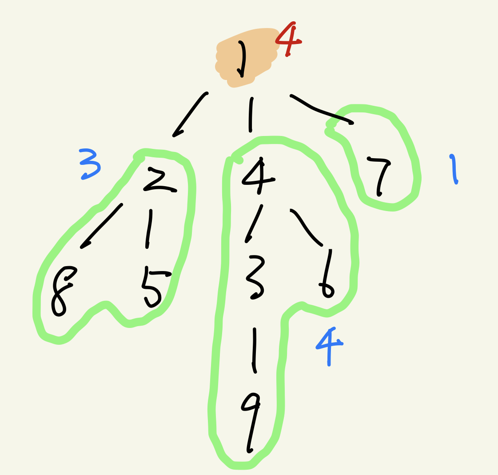
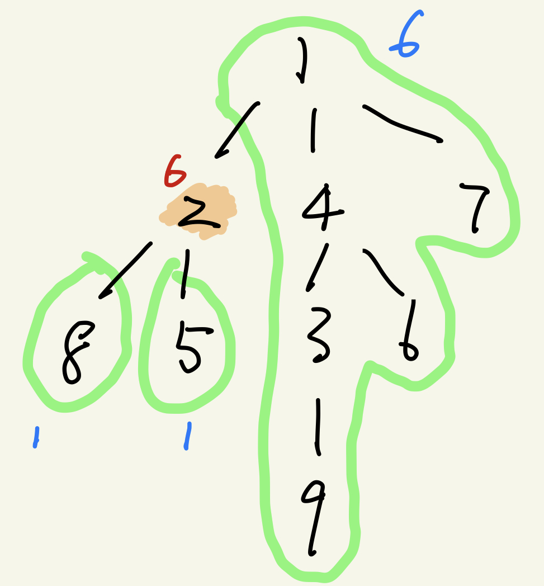
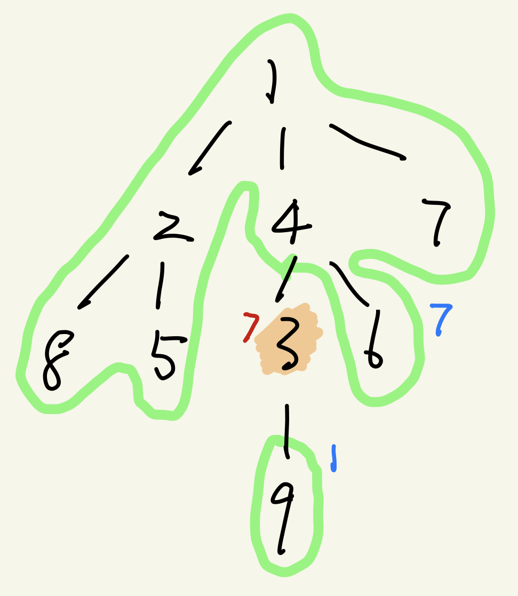

### 树与图的存储


##### 树是一种特殊的图，即无环连通图（所以，只考虑图的储存和遍历就可以了）


图分为两种，无向图和有向图。在储存图的时候，无向图可以看做特殊的有向图。

#### -->如何存储有向图

1. 邻接矩阵 2. 邻接表

#### 树和图的存储

(邻接表)

```c++
# include <cstring>
# include <iostream>
# include <algorithm>

using namespace std;

const int N = 10010, M = N * 2;
int n, m;

//邻接表法，储存图结构
int h[N], e[M], ne[M], idx;

//添加边
void add(int a, int b) {
     e[idx] = b, ne[idx] = h[a], h[a] = idx++;
}
```

#### 树和图的遍历

1. 深度优先遍历


```c++
bool st[N]; //标记是否已经被遍历过

void dfs(int u) {
     
     st[u] = true;
     
     for (int i = h[u]; i != -1; i = ne[i]) {
          int j = e[i];
          if (!st[j]) dfs(j);
     }
}
```


2. 宽度优先遍历


##### 图的宽度优先搜索的一个金典应用：求图的拓扑序（针对有向图）


- 有向无环图一定存在一个拓扑序列，因此，一个有向无环图也被称作拓扑图

- 一个有向无环图，一定至少存在一个入度为零的点


#### 相关题目


##### AcWing 846.树的重心

请你找到树的重心，并输出将重心删除后，剩余各个连通块中点数的最大值。

重心定义：重心是指树中的一个结点，如果将这个点删除后，剩余各个连通块中点数的最大值最小，那么这个节点被称为树的重心。

输入格式：

第一行包含整数 n，表示树的结点数。接下来 n−1 行，每行包含两个整数 a 和 b，表示点 a 和点 b 之间存在一条边。

输出格式：

输出一个整数 m，表示将重心删除后，剩余各个连通块中点数的最大值。

数据范围：

1≤n≤10^5^

输入样例：

```
9
1 2
1 7
1 4
2 8
2 5
4 3
3 9
4 6
```

输出样例：

```
4
```


#### 分析：

- 什么是树的重心？

示例：

|  |  |  |
| ------------------------------------------------------------ | ------------------------------------------------------------ | ------------------------------------------------------------ |
| 删除根节点后，子树的最大节点数-4                             | 删除值为2的节点，后的最大节点数-6                            | 删除值为3的节点，后的最大节点数-7                            |


而树的重心为所以节点，删除该节点后的子树的最大节点数中的最小值，即为树的重心


##### 代码如下：

```c++
#include <cstdio>
#include <cstring>
#include <iostream>
#include <algorithm>
using namespace std;

const int N = 100010, M = 2 * N;

int n;
//邻接表
int h[N], e[M], ne[M], idx;

int ans = N; //全局的答案：最小的最大值
bool st[N];

void add(int a, int b) {
     e[idx] = b, ne[idx] = h[a], h[a] = idx++;
}

//以u为根的子树中点的数量
int dfs(int u) {
     st[u] = true;
     int size = 0, sum = 1;
     for (int i = h[u]; i != -1; i = ne[i]) {
          int j = e[i];
          if (st[j]) continue;
          
          int s = dfs(j);
          size = max(size, s);
          sum += s;
     }
     size = max(size, n - sum - 1);
     ans = min(ans, size);
     
     return sum + 1;
}

int main() {
     cin >> n;
     
     memset(h, -1, sizeof h);
     
     for (int i = 0; i < n; i++) {
          int a, b;
          cin >> a >> b;
          add(a, b), add(b, a);
     }
     
     dfs(1);
     
     cout << ans << endl; 
     
     return 0;
}
```


##### AcWing 847.图中点的层次

给定一个 n 个点 m 条边的有向图，图中可能存在重边和自环。

所有边的长度都是 1，点的编号为 1∼n。

请你求出 1 号点到 n 号点的最短距离，如果从 1 号点无法走到 n 号点，输出 −1。

输入格式：

第一行包含两个整数 n 和 m。

接下来 m 行，每行包含两个整数 a 和 b，表示存在一条从 a 走到 b 的长度为 1 的边。

输出格式：

输出一个整数，表示 1 号点到 n 号点的最短距离。

数据范围：

1≤n,m≤10^5^

输入样例：

```markdown
4 5
1 2
2 3
3 4
1 3
1 4
```

输出样例：

```markdown
1
```


##### 代码如下：

```c++
#include <cstdio>
#include <cstring>
#include <iostream>
#include <algorithm>
using namespace std;

const int N = 100010;
int n, m;

//linklist
int h[N], e[N], ne[N], idx;

//queue
int d[N], q[N];

void add(int a, int b) {
     e[idx] = b, ne[idx] = h[a], h[a] = idx++;
}

int bfs() {
     
     int hh = 0, tt = 0;
     memset(d, -1, sizeof d);
     q[0] = 1;
     while(hh <= tt) {
          int t = q[hh++];
          for(int i = h[t]; i != -1; i = ne[i]) {
               int j = e[i];
               if (d[j] == -1) {
                    d[j] = d[t] + 1;
                    q[++tt] = j;
               }
          }
     }
     return d[n];
}

int main() {
     
     cin >> n >> m;
     
     memset(h, -1, sizeof h);
     
     for (int i = 0; i < m; i++) {
        int a, b;
        cin >> a >> b;
        add(a, b);
    }

    cout << bfs() << endl;

    return 0;
}
```


##### AcWing 848.有向图的拓扑序列

给定一个 n 个点 m 条边的有向图，点的编号是 1 到 n，图中可能存在重边和自环。

请输出任意一个该有向图的拓扑序列，如果拓扑序列不存在，则输出 −1。

若一个由图中所有点构成的序列 A 满足：对于图中的每条边 (x,y)，x 在 A 中都出现在 y 之前，则称 A 是该图的一个拓扑序列。

输入格式：

第一行包含两个整数 n 和 m。

接下来 m 行，每行包含两个整数 x 和 y，表示存在一条从点 x 到点 y 的有向边 (x,y)。

输出格式：

共一行，如果存在拓扑序列，则输出任意一个合法的拓扑序列即可。

否则输出 −1。

数据范围：

1≤n,m≤10^5^

输入样例：

```markdown
3 3
1 2
2 3
1 3
```

输出样例：

```markdown
1 2 3
```


##### 求图的拓扑序的解题思路：


//

queue <- 所有入度为0的点

while queue 不空 {
	t <- 队头

​	枚举 t 的所有出边 t -> j

​	删掉 t -> j, d[j]-- (j的入度减一)

​	if d[j] == 0:

​		queue <- j

}

//


##### 代码如下：


```c++
# include <iostream>
# include <cstring>
# include <algorithm>

using namespace std;

const int N = 100010;
int n, m;

//linklist
int h[N], e[N], ne[N], idx;

//queue
int d[N], q[N]; //d[N] 储存入度

void add(int a, int b) {
     e[idx] = b, ne[idx] = h[a], h[a] = idx++;
}

bool topsort() {
     int hh = 0, int tt = -1;
     
     for (int i = 1; i <= n; i++) {
          if(!d[i]) {
               q[++tt] = i;
          }
     }
     
     while(hh <= tt) {
          int t = q[hh++];
          for (int i = h[t]; i != -1; i = ne[i]) {
               int j = e[i];
               if(--d[j] == 0) {
                    q[++tt] = j;  //如果，去掉这条边，入度为零，则说明，到头了！！ 
               }
          }
     }
     return tt == n-1
}

int main() {
    
    cin >> n >> m;
    
    memset(h, -1, sizeof h);
    
    for(int i = 0; i < m; i++) {
        int a, b;
        cin >> a >> b;
        add(a, b);
        d[b] ++ ;
    }
    
    if (topsort()) {
        for (int i = 0; i < n; i ++ ) printf("%d ", q[i]);
        puts("");

    }else {
        puts("-1");
    }
    
    return 0;
}
```

