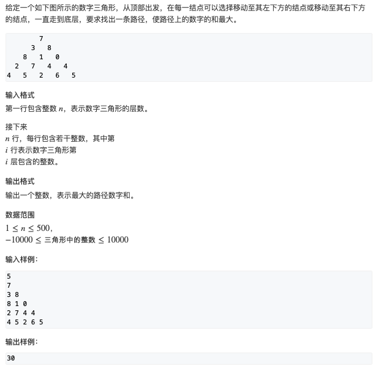
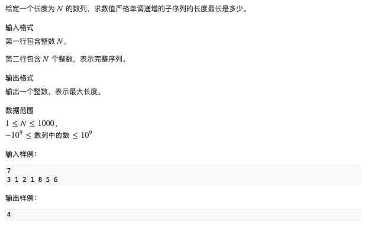
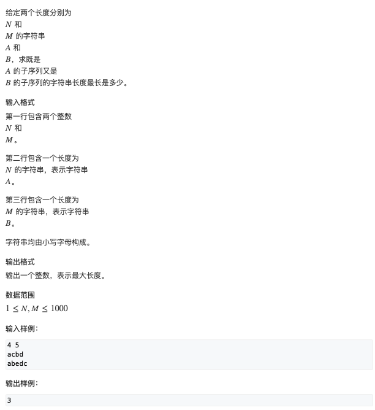
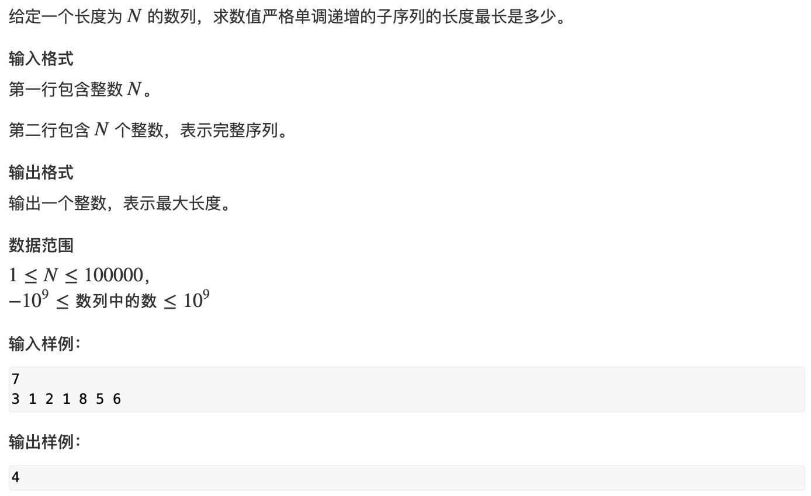
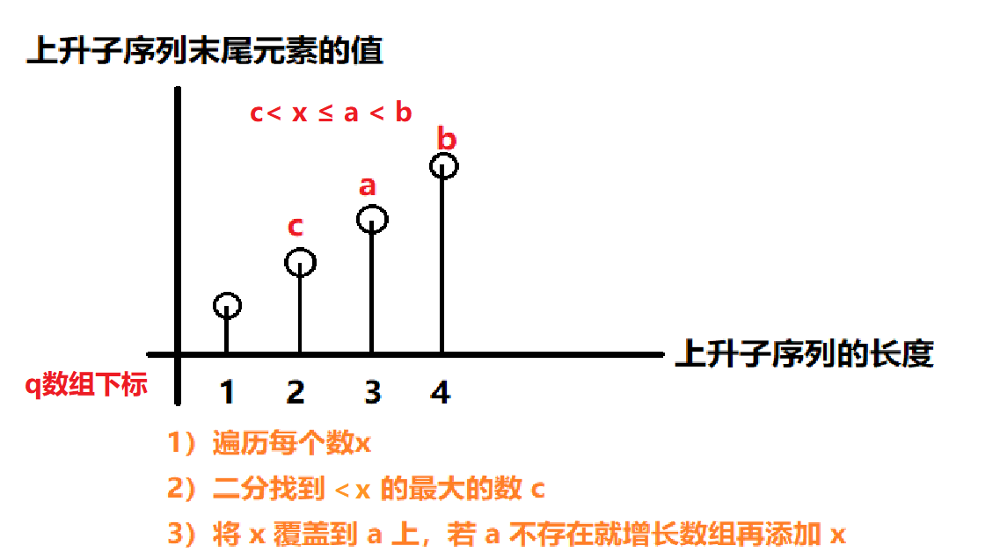
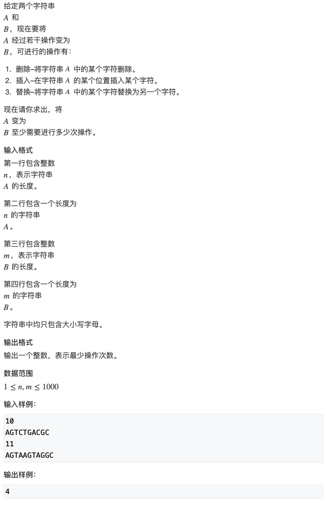
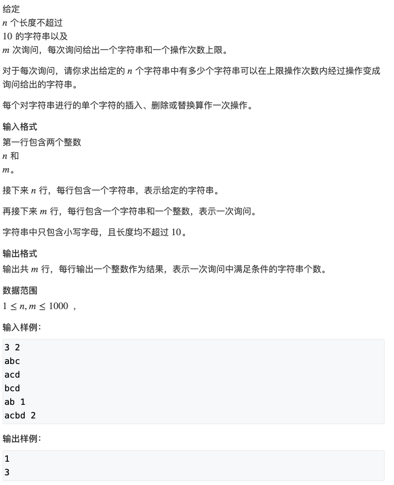

# 线性DP

## 数字三角形问题

- **[数字三角形](https://www.acwing.com/activity/content/problem/content/1002/)**




#### 思路1：（自顶向下）

- **状态表示：**
  - 集合：所有从起点，走到(i, j)的路径
  - 属性：最大值

- **状态计算：**
  - 来自左上：f[i, j] = f[i-1\][j-1] + a[i\][j]
  - 来自右下：f[i, j] = f[i-1\][j] + a[i\][j]


```c++
#include <iostream>
#include <algorithm>

using namespace std;

const int N = 510, INF = 1e9;

int n;
int a[N][N];
int dp[N][N];

int main() {
     
     cin >> n;
     
     for (int i = 1; i <= n; ++i) {
          for (int j = 1; j <= i; ++j) {
               cin >> a[i][j];
          }
     }
     
     // 初始化
     for (int i = 0; i <= n; ++i) {
          for (int j = 0; j <= i + 1; ++j) {
               dp[i][j] = -INF;
          }
     }
     
     dp[1][1] = a[1][1];
     for (int i = 2; i <= n; ++i) {
          for (int j = 1; j <= i; ++j) {
               dp[i][j] = max(dp[i-1][j-1]+a[i][j], dp[i-1][j]+a[i][j]);
          }
     }
     
    int res = -INF;
    for (int i = 1; i <= n; ++i) res = max(res, dp[n][i]);
    
    cout << res << endl;
    
    return 0;
}
```


#### 思路2：（自底向上）

- **状态表示：**
  - 集合：所有从起点，走到(i, j)的路径
  - 属性：最大值

- **状态计算：**
  - 来自左上：f[i, j] = f[i-1\][j-1] + a[i\][j]
  - 来自右下：f[i, j] = f[i-1\][j] + a[i\][j]


```c++
#include <iostream>
#include <algorithm>

using namespace std;

const int N = 510, INF = 1e9;

int n;
int a[N][N];
int dp[N][N];

int main() {
     
     cin >> n;
     
     for (int i = 1; i <= n; ++i) {
          for (int j = 1; j <= i; ++j) {
               cin >> a[i][j];
          }
     }
     
     // 初始化
     for (int i = 0; i <= n; ++i) {
          for (int j = 0; j <= i + 1; ++j) {
               dp[i][j] = -INF;
          }
     }
     
     // 最后一行初始化
     for (int i = 0; i <= n; ++i) dp[n][i] = a[n][i];
     
     for (int i = n-1; i >= 1; --i) {
          for (int j = 1; j >= i; ++j) {
               dp[i][j] = max(dp[i+1][j+1]+a[i][j], dp[i+1][j]+a[i][j]);
          }
     }
     
     cout << dp[1][1] << endl;
     
     return 0;
     
}
```


## 最长上升子序列

- [最长上升子序列](https://www.acwing.com/activity/content/problem/content/1003/)




#### 思路：

- 状态表示：
  - 集合：所有以第 i 个数结尾的上升子序列
  - 属性：子序列的长度的最大值
- 状态计算：
  - 第 1 个：1
  - 第 2 个：max(f[2], f[1] + 1)
  - ......
  - 第 i - 1 个：max(f[i], f[i-1]+1)


```c++
#include <iostream>
#include <algorithm>

using namespace std;

const int N = 1010;

int n;
int a[N], f[N];
// int g[N];


int main() {
     
     cin >> n;
     for (int i = 1; i <= n; ++i) cin >> a[i];
     
     for (int i = 1; i <= n; ++i) {
          f[i] = 1;
          for (int j = 1; j < i; ++j) {
               if (a[j] < a[i]) f[i] = max(f[i], f[j] + 1);
          }
     }
     
     int res = 0;
     for (int i = 1; i <= n; ++i) res = max(res, f[i]);
     
     cout << res << endl;
     
     return 0;
}
```


## 最长公共子序列


- [最长公共子序列](https://www.acwing.com/activity/content/problem/content/1005/)





#### 思路：

- 状态表示：f[i, j]
  - 集合：所有在第一个序列的前 i 个字母中出现，且在第二个序列的前 j 个字母中出现的公共子序列
  - 属性：长度的最大值，Max

- 状态计算：
  - 不选第一个序列，也不选第二个序列：f[i-1, j-1]
  - 选第一个序列，不选第二个序列：f[i-1, j]
  - 不选第一个序列，选第二个序列：f[i, j-1]
  - 选第一个序列，选第二个序列：f[i-1, j-1] + 1

**(注：这里四种划分方式有重叠计算的情况)**


```c++
#include <iostream>
#include <algorithm>

using namespace std;

const int N = 1010;

int n, m;
char a[N], b[N];
int f[N][N];

int main() {
     
     // cin >> n >> m;
     scanf("%d%d", &n, &m);
     scanf("%s%s", a+1, b+1);
     
     for (int i = 1; i <= n; ++i) {
          for (int j = 1; j <= m; ++j) {
               f[i][j] = max(f[i-1][j], f[i][j-1]);
               if (a[i] == b[j]) f[i][j] = max(f[i][j], f[i-1][j-1] + 1);
          }
     }
     
     cout << f[n][m] << endl;
     
     return 0;
}
```


## 最长上升子序列||

- [最长上升子序列||](https://www.acwing.com/activity/content/problem/content/1004/)




- 问题难点：数据量增加，需要提高时间复杂度


#### 思路：[贪心+二分法](https://www.acwing.com/solution/content/6525/)




- [题解](https://www.acwing.com/solution/content/3783/)


(回头从新弄清楚)


```c++
#include <iostream>
#include <algorithm>

using namespace std;

const int N = 100010;

int n, a[N]; // a[N] 储存数列
int q[N]; // q[i] 储存以长度为i的上升子序列中末尾元素最小的数

int main() {
    
    cin >> n;
    for (int i = 0; i < n; ++i) cin >> a[i];
    
    int len = 0;
    q[0] = -2e9;
    for (int i = 0; i < n; ++i) {
        // q[i]单调递增,目的是找到q中小于a[i]的最大的数
        int l = 0, r = len;
        while (l < r) {
            int mid = l + r + 1 >> 1;
            if (q[mid] < a[i]) l = mid;
            else r = mid - 1;
        }
        len = max(len, r + 1);
        q[r + 1] = a[i];
    }
    
    cout << len << endl;
    
    return 0;
    
}
```


## 最短编辑距离

- [最短编辑距离](https://www.acwing.com/activity/content/problem/content/1094/)





#### 思路：

- 状态表示：f[i, j]
  - 集合：所有将A[1\~i]变成B[1~j]的操作方式
  - 属性：min

- 状态计算：
  - 增：f[i, j] = f[i\][j-1] + 1
  - 删：f[i, j] = f[i-1\][j] + 1
  - 改：
    - A[i] == B[j]:f[i\][j] = f[i-1\][j-1]
    - A[i] != B[j]:f[i\][j] = min(f[i\][j], f[i-1\][j-1] + 1)


```c++
#include <iostream>
#include <algorithm>

using namespace std;

const int N = 1010;

int n, m;
char a[N], b[N];
int f[N][N];

int main() {
     
     scanf("%d%s", &n, a + 1);
     scanf("%d%s", &m, b + 1);
     
     for (int i = 0; i <= n; ++i) f[i][0] = i;
     for (int i = 0; i <= m; ++i) f[0][i] = i;
     
     for (int i = 1; i < n; ++i) {
          for (int j = 1; j < m; ++j) {
               f[i][j] = min(f[i][j-1] + 1, f[i-1][j] + 1);
               if (a[i] == b[j]) f[i][j] = min(f[i][j], f[i-1][j-1]);
               else f[i][j] = min(f[i][j], f[i-1][j-1] + 1);
          }
     }
     
     cout << f[n][m] << endl;
     
     return 0;
}
```


## 编辑距离

- [编辑距离](https://www.acwing.com/activity/content/problem/content/1006/)




#### 思路：类似最短编辑距离

```c++
#include <iostream>
#include <algorithm>
#include <string.h>

using namespace std;

const int N = 15, M = 1010;
int n, m;
int f[N][N];
char str[M][N];

int edit_distence(char a[], char b[]) {
    
    int la = strlen(a + 1), lb = strlen(b + 1);
    
    for (int i = 0; i <= lb; ++i) f[0][i] = i;
    for (int i = 0; i <= la; ++i) f[i][0] = i;
    
    for (int i = 1; i <= la; ++i) {
        for (int j = 1; j <= lb; ++j) {
            f[i][j] = min(f[i-1][j] + 1, f[i][j-1] + 1);
            if (a[i] == b[j]) f[i][j] = min(f[i][j], f[i-1][j-1]);
            else f[i][j] = min(f[i][j], f[i-1][j-1] + 1);
        }
    }
    
    return f[la][lb];
}

int main() {
    
    scanf("%d%d", &n, &m);
    for (int i = 0; i < n; ++i) scanf("%s", str[i] + 1);
    
    while (m--) {
        char s[N];
        int limit;
        scanf("%s%d", s + 1, &limit);
        
        int res = 0;
        for (int i = 0; i < n; ++i) {
            if (edit_distence(str[i], s) <= limit) res++;
        }
        
        cout << res << endl;
    }
    
    return 0;
}

```


