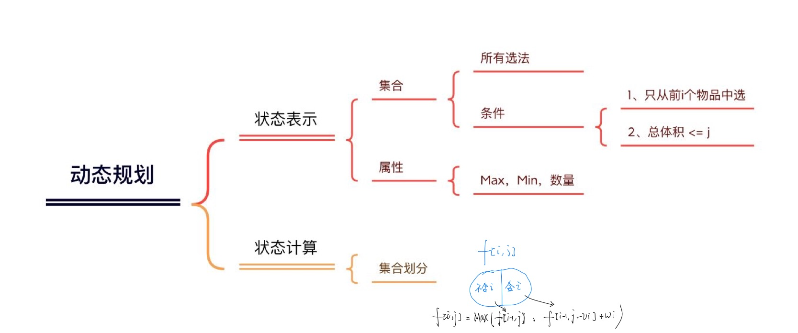
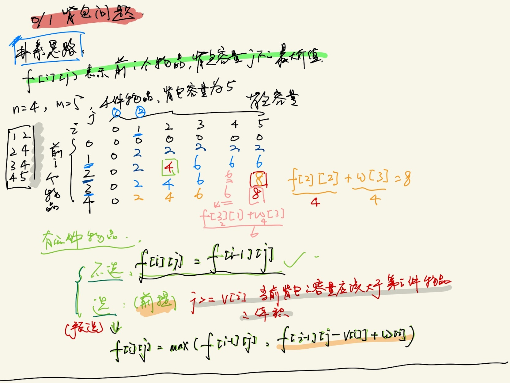
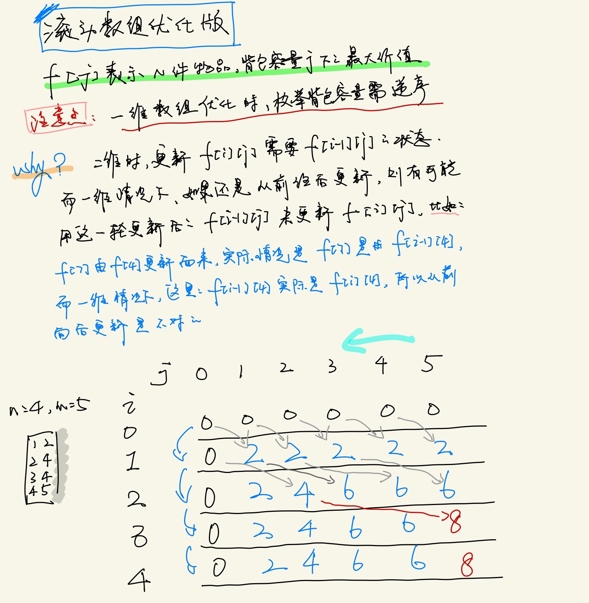
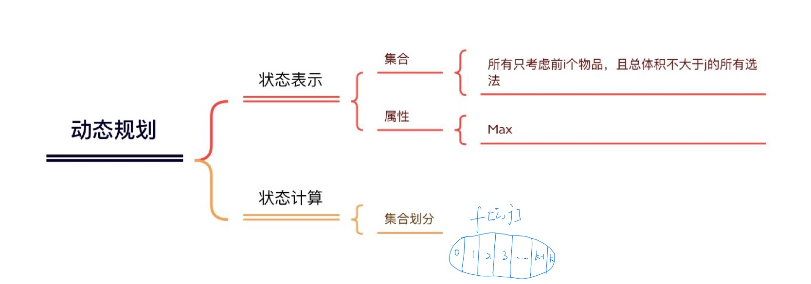
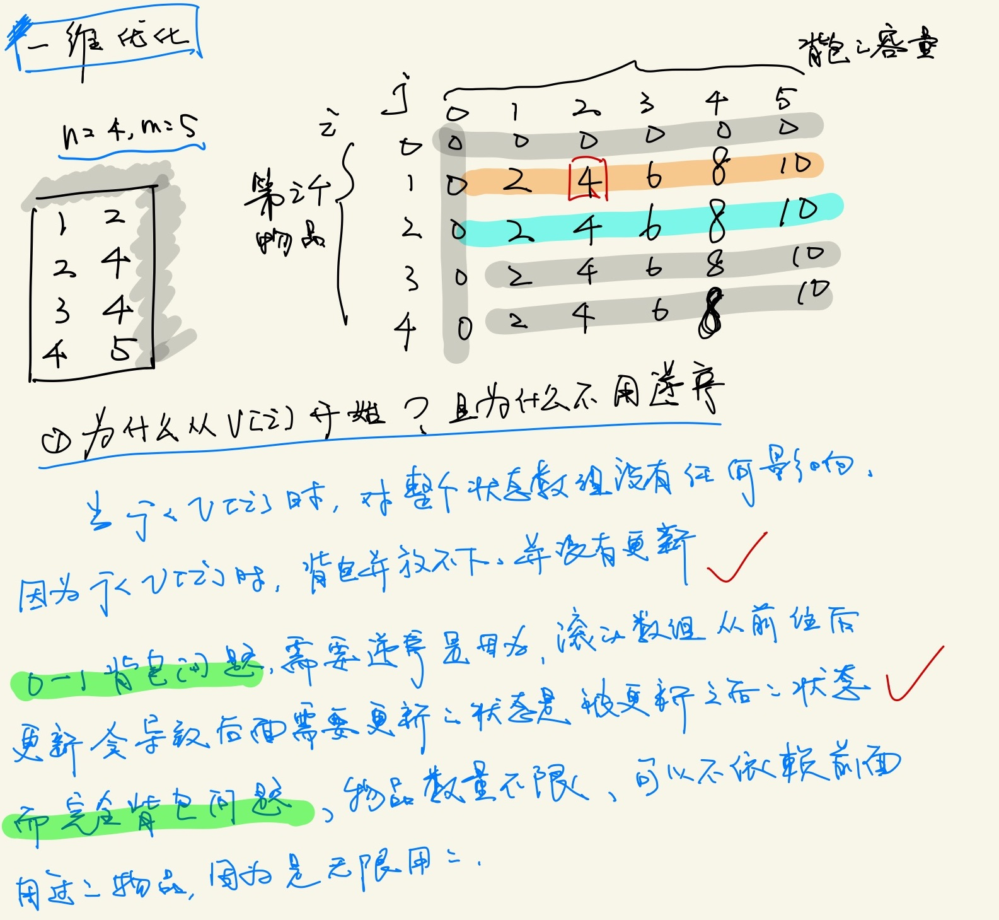

## 0 1 背包问题


- 每件物品最多只能用一次




##### AcWing 2. 01背包问题

有 N 件物品和一个容量是 V 的背包。每件物品只能使用一次。

第 i 件物品的体积是 vi，价值是 wi。

求解将哪些物品装入背包，可使这些物品的总体积不超过背包容量，且总价值最大。

输出最大价值。

输入格式：

第一行两个整数，N，V，用空格隔开，分别表示物品数量和背包容积。

接下来有 N 行，每行两个整数 vi,wi，用空格隔开，分别表示第 i 件物品的体积和价值。

输出格式：

输出一个整数，表示最大价值。

数据范围：

0<N,V≤1000

0<vi,wi≤1000

输入样例：

```markdown
4 5
1 2
2 4
3 4
4 5
```

输出样例：

```markdown
8
```





##### CODE 1.0:

```c++
#include <iostream>
#include <algorithm>

using namespace std;

const int N = 1010;

int n, m;
int v[N], w[N];
int f[N][N];

int main() {
     cin >> n >> m;
     
     for (int i = 1; i <= n; i++) cin >> v[i] >> w[i];
     
     for (int i = 1; i <= n; i++) {
          for (int j = 0; j <= m; j++) {
               f[i][j] = f[i-1][j];
               if (j >= v[i]) f[i][j] = max(f[i][j], f[i-1][j - v[i]] + w[i]); 
          }
     }
     
     cout << f[n][m] << endl;
     
     return 0;
}
```





##### CODE 2.0:

```c++
#include <iostream>
#include <algorithm>

using namespace std;

const int N = 1010;
int n, m;
int v[N], w[N];
int f[N];

int main() {
     cin >> n >> m;
     
     for (int i = 1; i <= n; i++) cin >> v[i] >> w[i];
     
     for (int i = 1; i <= n; i++) {
          for (int j = m; j >= v[i]; j--) {
               f[j] = max(f[j], f[j - v[i]] + w[i]);
          }
     }
     
     cout << f[m] << endl;
     
     return 0;
}
```


## 完全背包问题


- 每件物品能够无限用





- 集合划分：

  - 0 - 不选：f[i-1]\[j]
  - 1 ~ k - 选 k 个：
    - 曲线救国：
      1. 去掉 k 个物品 i
      2. 求Max：f[i-1]\[j - k * v[i]]
      3. 再加回来 k 个物品 i

  ##### f[i-1]\[j - k * v[i]] + k * w[i]


#### 状态转移方程：

- #### f[i]\[j] = f[i-1]\[j - k * v[i]] + k * w[i]


##### AcWing 3. 完全背包问题

有 N 种物品和一个容量是 V 的背包，每种物品都有无限件可用。

第 i 种物品的体积是 vi，价值是 wi。

求解将哪些物品装入背包，可使这些物品的总体积不超过背包容量，且总价值最大。

输出最大价值。

输入格式:

第一行两个整数，N，V，用空格隔开，分别表示物品种数和背包容积。

接下来有 N 行，每行两个整数 vi,wi，用空格隔开，分别表示第 i 种物品的体积和价值。

输出格式:

输出一个整数，表示最大价值。

数据范围:

0<N,V≤1000

0<vi,wi≤1000

输入样例:

```markdown
4 5
1 2
2 4
3 4
4 5
```

输出样例：

```markdown
10
```


##### 朴素版代码：

```c++
#include <iostream>
#include <algorithm>

using namespace std;

const int N = 1010;
int n, m;

int v[N], w[N];
int f[N][N];


int main() {
    
    cin >> n >> m;
    
    for (int i = 1; i <= n; i++) cin >> v[i] >> w[i];
    
    for (int i = 1; i <= n; i++) 
        for (int j = 0; j <=m; j++)
            for (int k = 0; k * v[i] <= j; k++)
                f[i][j] = max(f[i][j], f[i-1][j - k * v[i]] + k * w[i]); 
                
    cout << f[n][m] << endl;
    
    return 0;
}
```


##### 二维优化:

```c++
#include <iostream>
#include <algorithm>

using namespace std;

const int N = 1010;
int n, m;
int v[N], w[N];
int f[N][N];

int main() {
     
     cin >> n >> m;
     
     for (int i = 1; i <= n; i++) cin >> v[i] >> w[i];
     
     for (int i = 1; i <= n; i++) {
          for (int j = 0; i <= n; j++) {
               f[i][j] = f[i-1][j];
               if (j >= v[i]) f[i][j] = max(f[i][j], f[i-1][j - v[i]] + w[i]);
          }
     }
     
     cout << f[n][m] << endl;
     
     return 0;
}
```


##### 一维优化：





```c++
#include <iostream>
#include <algorithm>

using namespace std;

const int N = 1010;
int n, m;
int v[N], w[N];
int f[N];

int main() {
     
     cin >> n >> m;
     
     for (int i = 1; i <= n; i++) cin >> v[i] >> w[i];
     
     for (int i = 1; i <= n; i++) {
          for (j = v[i]; j <= m; j++) {
               f[j] = max(f[j], f[j-v[i]] + w[i]);
          }
     }
     
     cout << f[m] << endl;
     
     return 0;
}
```


## 多重背包问题


[多重背包问题 I](https://www.acwing.com/problem/content/4/)

[多重背包问题 II](https://www.acwing.com/problem/content/5/)


- 每件物品的数量不一样


### 朴素版


```c++
#include <iostream>
#include <algorithm>

using namespace std;

const int N = 110;
int n, m;
int v[N], w[N], s[N];
int dp[N][N];

int main() {
     
     cin >> n >> m;
     
     for (int i = 1; i <= n; ++i) cin >> v[i] >> w[i] >> s[i];
     
     for (int i = 1; i <= n; ++i) {
          for (int j = 0; j <= m; ++j) {
               for (int k = 0; k <= s[i] && k * v[i] <= j; ++k) {
                    dp[i][j] = max(dp[i][j], dp[i-1][j-k*v[i]]+k*w[i]);
               }
          }
     }
     
     cout << dp[n][m] << endl;
     
     return 0;
}
```


### 优化版

##### (二进制优化)

[大厂狗狗的题解](https://www.acwing.com/solution/content/20115/)


##### 思路：使用二进制表示来打包所有的 s 件物品

##### 如：某件物品有 14 件，则用二进制来表示就是可以分别打包成：$2^3,2^2$件


```c++
#include <iostream>
#include <algorithm>

using namespace std;

const int N = 25000, M = 2010;
int n, m;
int v[N], w[N];
int dp[N];

int main() {
     
     cin >> n >> m;
     
     // 打包
     int cnt = 0;
     for (int i = 1; i <= n; ++i) {
          int a, b, s;
          cin >> a >> b >> s;
          
          int k = 1;
          while (k <= s) {
               cnt++;
               v[cnt] = a * k;
               w[cnt] = b * k;
               s -= k;
               k *= 2;
          }
          if (s > 0) {
               cnt++;
               v[cnt] = a * s;
               w[cnt] = b * s;
          }
     }
     
     n = cnt;
     
     // 0-1 背包问题
     for (int i = 1; i <= n; ++i) {
          for (int j = m; j >= v[i]; --j) {
               dp[j] = max(dp[j], dp[j-v[i]]+w[i]);
          }
     }
     
     cout << dp[m] << endl;
     
     return 0;
}
```


## 分组背包问题


[AcWing 9. 分组背包问题](acwing.com/problem/content/9/)


- 每一组里面最多只能选一个物品


```c++
#include <iostream>
#include <algorithm>

using namespace std;

const int N = 110;
int n, m;
int v[N][N], w[N][N], s[N];
int dp[N];

int main() {
     
     cin >> n >> m;
     
     for (int i = 1; i <= n; ++i) {
          cin >> s[i];
          for(int j = 0; j < s[i]; ++j) cin >> v[i][j] >> w[i][j];
     }
     
     for (int i = 1; i <= n; ++i) {
          for (int j = m; j >= 0; --j) {
               for (int k = 0; k < s[i]; ++k) {
                    if (v[i][j] <= j) 
                         dp[j] = max(dp[j], dp[j-v[i][k]]+w[i][k]);
               }
          }
     }
     
     cout << dp[m] << endl;
     
     return 0;
}
```


